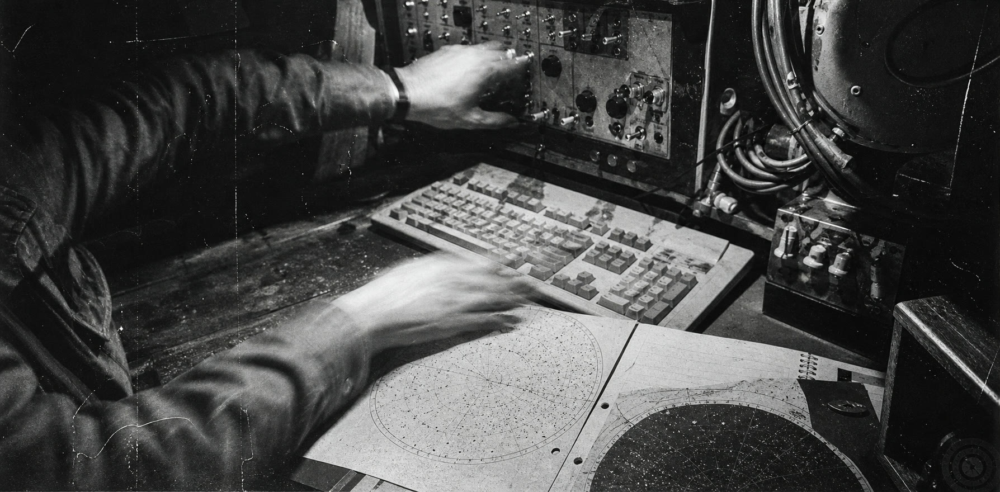
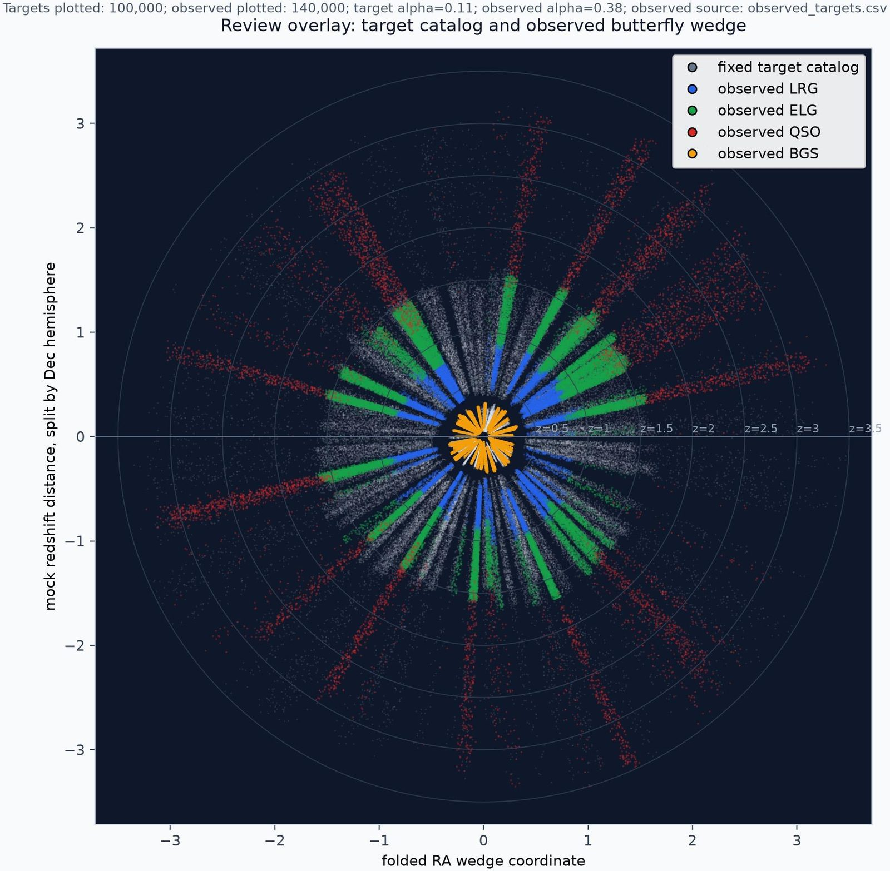
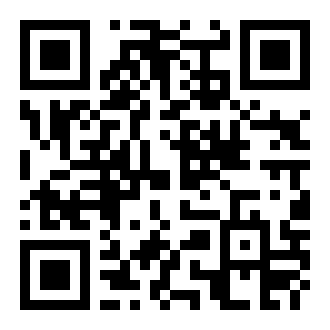
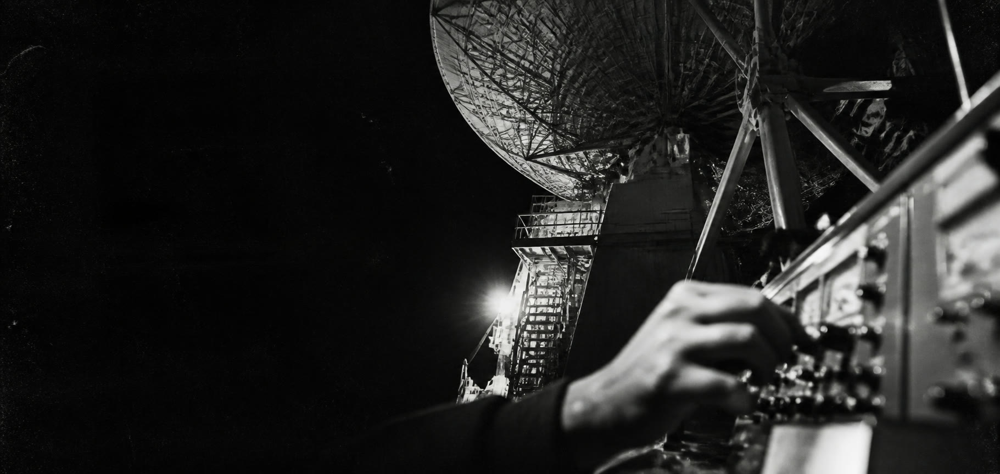

# GOSIM 2026 巡天智能体黑客松正式启动：让 AI 决定巡天望远镜下一步看哪里，5,500 美元奖金池等你来战！

> **望远镜不会等你想清楚。下一个 900 秒，你的智能体看向哪里？**

---

每一个晴朗的夜晚，天文台的观测员都在反复回答同一个问题：**接下来的 900 秒，望远镜该对准哪一片天？** 天气在变，目标在升落，科学优先级各有轻重，而一次糟糕的选择，就白白烧掉了真实的观测时间。
 
现在，**GOSIM** 把这道题做成了一场面向全球开发者的黑客松——**巡天智能体（Agent Observer）黑客松**。你要写一个智能体：读取天空状态，像资深观测员一样权衡，每隔 900 秒让它决定下一步观测什么。**不需要望远镜，不需要天文背景，个人或团队都能参加。**

> **📌 关键信息**
>
> - 💰 **奖金**：5,500 美元，设 6 个奖项
> - 🎁 **福利**：开源模型 Token 支持 · 天文学与智能体专家训练营指导 · 完赛证书
> - 📅 **赛程**：10 月 1–4 日线上训练营 · 10 月 5–7 日线上比赛 · 10 月 17 日深圳颁奖
> - ⏰ **报名截止**：10 月 1 日，名额报满即止（练习赛已开放）
> - 👥 **谁能参加**：全球开放，个人或 1–3 人团队，无需天文背景
> - 🚀 **怎么开始**：注册 → 建队 → 下载入门包 → 20 分钟跑出第一个成绩
>
> 👉 **点击文末「阅读原文」或扫码进入竞赛官网，现在就去注册**
 
---

## 01 · 这是一场怎样的比赛？

现代巡天望远镜不是"对准一个目标，然后拍下来"那么简单。一个观测夜里，天气会变，目标会升落，不同科学任务对观测条件有不同要求；巡天本身还有自己的完成进度、区域覆盖要求和临时观测请求。

所以观测员真正要回答的问题不是"现在天上有什么可以看"，而是"在当前条件下，现在看什么最值得"。一个经验丰富的主值观测员，会不断在科学价值、天气条件、目标可见性、巡天进度和时间成本之间做权衡。

Agent Observer 把这种权衡收敛成一个清晰的 AI 任务：读取当前状态 → 理解局势 → 比较候选 → 做出观测决策 → 环境继续变化 → 再次决策。每个决策时隙是 900 秒，也就是 15 分钟。你设计的不是一个只回答一次问题的 AI，而是一个在连续环境中持续做决定的观测智能体。

---

## 02 · 为什么让 AI 来做这件事？

Agent 的真正挑战在于"会持续决策"，而不仅仅是"会回答"。过去我们让 AI 回答问题、写代码、生成内容、调用工具，这些任务大多是孤立的；可一旦 AI 进入真实世界，它面对的就往往是一个持续变化的环境——今天的选择会改变明天的状态，现在省下的时间可能换来下一次更好的机会，一次错误判断也可能让后续计划越来越困难。

巡天观测正好是这样一个干净的实验场。它同时具备几样东西：

- **不确定性**：天气和观测条件会变；
- **有限资源**：每一个 900 秒的时隙都不可逆；
- **长期目标**：整个巡天任务需要持续推进；
- **多目标权衡**：科学价值、优先级和覆盖之间经常打架；
- **连续决策**：每一个动作都会影响后续状态；
- **可量化结果**：最终观测产出可以被统一打分。

所以 Agent Observer 真正让你挑战的就是一个问题：在不断变化的世界里，一个智能体能不能持续做出合理的下一步决定？巡天只是场景，连续决策才是核心。

---

## 03 · 你到底要做什么？

### 给你的智能体一个"观测员"的位置

比赛提供一套统一的巡天任务和模拟环境。在每个决策时隙，你的智能体都会拿到与当前决策相关的一组信息——当前天气与观测条件、已发布的天气预报、当前巡天任务的完成进度、当前可观测的候选天区，以及不同观测项目的要求——然后它需要决定下一步做什么。

你的策略可以很简单，也可以逐渐复杂。可以从规则、排序和启发式方法起步，也可以再叠加记忆、预测、优化算法或大模型，让 智能体处理更复杂的决策。比赛不限定技术路线，看的是你在统一评测环境里能不能做出更有效、更稳健的连续决策。

---

## 04 · 这场比赛有什么特别？

### ① 来自真实科学问题，而不是科幻设定

赛题参考 DESI 等真实巡天任务的公开科学与运行设计，再通过模拟器把复杂决策转化成开发者可以参与的挑战。你不会控制真实望远镜，也不会影响真实科学观测，但你面对的是一个有真实任务逻辑的决策环境：天气、时间、目标、任务和巡天进度彼此牵制。这让它既是一场黑客松，也是一次 AI for Science 的决策实验。

### ② 让 Agent 真正"跑起来"，而不是只交一个 Demo

很多 AI 黑客松最后展示的是一个漂亮的 Demo；Agent Observer 把重点放在让你的智能体真正运行一整个模拟巡天任务。一个策略不能只在某一刻看起来聪明，它需要在一整夜里连续面对变化的环境，并让整个巡天任务的结果尽可能更好。你可以反复跑：运行 → 观察结果 → 找到问题 → 修改策略 → 再运行。每跑一次，你都会更了解自己的策略。

### ③ 所有人面对统一的评测环境

比赛提供统一的任务定义、模拟器和评分体系。正式比赛中，智能体面对的天气、预报和事件不会提前下载给参赛者，你需要根据当下能拿到的信息做决定，而不是提前知道未来的"正确答案"。开发场景和正式评测场景分开，比赛想看的是策略面对新场景时的表现，而不是针对一份已知天气回放去调参。

### ④ 结果能被看见，也能被复盘

一次运行结束后你不只是拿到一个分数，平台还会给出分数分解、逐夜运行结果、决策记录、运行日志，以及观测结果的可视化。你可以清楚看到自己的智能体看了哪里、错过了什么、浪费了什么，以及为什么会得到这个结果。

---

## 05 · 谁适合参加？

### 不需要天文学背景

这是我们特别想强调的一点：你不需要先成为天文学家才能参加 Agent Observer。赛事面向全球开放，个人和团队均可参加，每队 1–3 人。

- 🤖 **AI / Agent 开发者**：如果你正在做 Agent、工作流、规划、记忆、多智能体或 LLM 应用，这里有一个非常具体的环境，能把智能体从"聊天"推进到"连续决策"。
- 💻 **Python 开发者**：如果你喜欢算法、工程实践和策略优化，可以从一个简单策略起步，再不断提高分数。
- 🌌 **天文 / AI for Science 爱好者**：如果你对宇宙、望远镜、科学计算或 AI for Science 感兴趣，这是一个把科学问题变成 Agent 挑战的机会。
- 🎓 **学生和初学者**：没有丰富的智能体经验也没关系，赛事提供入门工具包和线上培训，你可以先跑通基线，再一点一点改自己的策略。
- 🧠 **喜欢复杂决策问题的人**：如果你的兴趣是「在有限资源和不断变化的环境里，下一步到底怎么选」，这道题本身就值得挑战。

---

## 06 · 你能获得什么？

### 💰 5,500 美元奖金池

| 奖项 | 名额 | 单项奖金 |
|---|---:|---:|
| 🥇 一等奖 | 1 | $2,000 |
| 🥈 二等奖 | 2 | $1,000 |
| 🥉 三等奖 | 3 | $500 |

### 🤖 开源模型 Token 支持
 
想让大模型参与你的决策，不必先为调用成本发愁：参赛队伍将获得开源模型 Token 支持。
 
### 🎓 天文学 + 智能体，双领域专家指导
 
线上训练营邀请天文学和智能体两方面的专家，带你读懂赛题背后的观测逻辑，也帮你把想法变成可运行的策略。

### 🌍 GOSIM 全球开源创新汇

排名前三的队伍将受邀参加 2026 年 10 月 17 日 GOSIM Shenzhen 颁奖活动，与全球开发者、AI 工程师、开源社区和技术专家当面交流。无法到场也可以领奖，跨地区参赛者同样可以参与。

### 🏅 完赛证书与成果展示

赛事为完赛队伍提供官方完赛证书和相关赛事成果记录，优秀作品还有机会通过 GOSIM 社区获得进一步的展示和交流机会。

### 📊 看见自己的 Agent 是怎么工作的

平台提供排行榜、运行结果和决策复盘能力。你可以从一个分数开始追问：我的 Agent 为什么得到这个结果？这对研究 Agent 行为、策略设计和 AI 决策系统本身，是一种非常直接的实验方式。

---

## 07 · 赛程怎么走？

| 阶段 | 时间 | 形式 | 内容 |
|---|---|---|---|
| 📝 **报名与练习赛** | 即日起 | 线上 | 注册、组队，公开场景随时练手，每队每天 50 次提交 |
| 📚 **线上训练营** | 10 月 1–4 日 | 线上 | 赛题讲解、工具包培训，天文学与智能体专家指导与答疑 |
| ⚔️ **线上比赛** | 10 月 5–7 日 | 线上 | 提交智能体，参与正式评测与排名 |
| 🏆 **颁奖** | 10 月 17 日 | GOSIM 深圳 | 公布最终成绩并举行颁奖活动 |

**以上时间以北京时间为准（UTC+8），报名截止时间为10月1日，名额报满即止，建议尽早注册。**

练习赛已经开放。你可以提前注册、建队、下载入门工具包并跑通自己的第一个策略，不必等正式比赛开始才第一次接触赛题。

---

## 08 · 20 分钟，跑出你的第一个成绩

### 先跑通，再想怎么赢

第一次参加，不用一上来就设计复杂 Agent。最简单的流程是这样的：

1. **报名**：注册 Agent Observer 比赛平台账号。
2. **建队**：个人参赛也需要建立队伍，每队最多 3 人。
3. **下载入门工具包**：跑通官方提供的基线程序，先看到一次完整的巡天结果。
4. **改你的策略**：从最简单的选择规则开始，让 Agent 尝试不同的观测决策。
5. **提交评测**：把智能体提交到比赛平台。
6. **看结果，再改一次**：观察分数、运行结果和决策记录，继续优化。

**先跑通基线，再想办法超过它。**

---

## 09 · 现在就加入

**报名截止 10 月 1 日，名额报满即止。** 报名、组队、提交统一在比赛平台完成，扫码或点击「阅读原文」进入官网。

竞赛官网：https://create.gosim.org/survey26/

联系邮箱：hackathon@gosim.org

GOSIM Shenzhen 2026 将于 10 月 16–17 日在深圳举行，汇聚 150+ 全球讲师与 2000+ 一线开发者。大会官网：https://shenzhen2026.gosim.org/

---

> ###  把夜空的下一步，交给你写的智能体。
>
> **GOSIM 2026 · Agent Observer**
