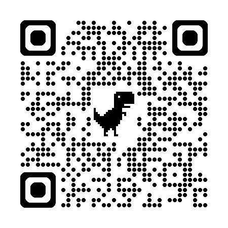
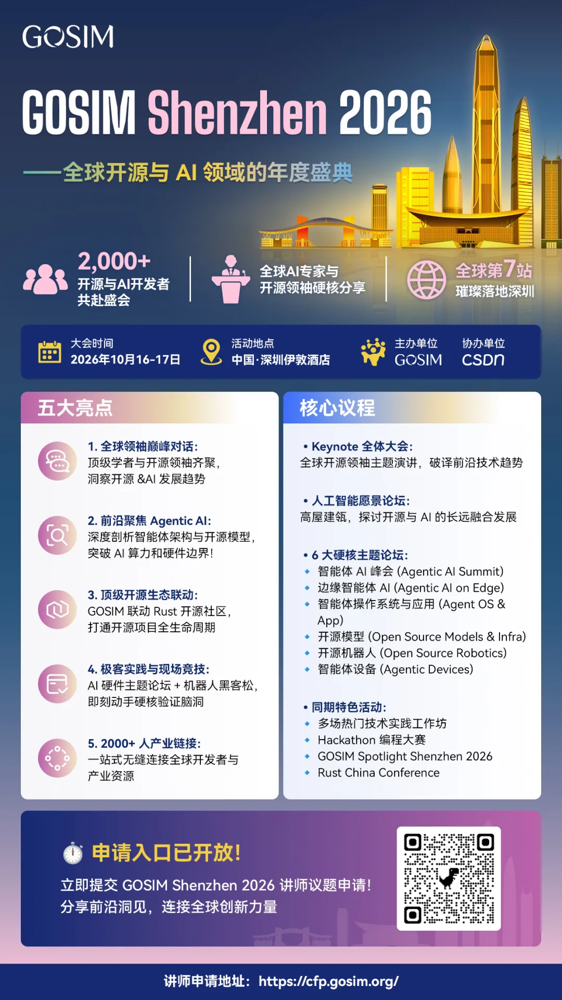
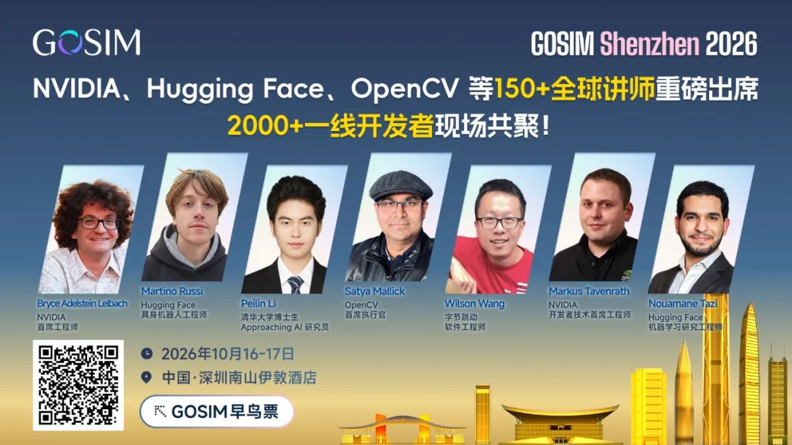
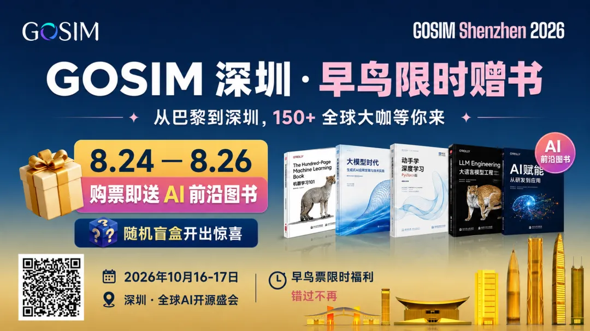

# GOSIM Shenzhen 2026 智能体软件工厂黑客松重磅启动！六周赛程，24000 美元奖金池，等你来战！

> **一句话摘要**：GOSIM 智能体软件工厂（Agentic Software Factory）黑客松 2026 招募中——用真实模型、统一沙箱、完全开源的技术栈，亲手挑战智能体驱动软件开发的实战。**24,000 美元奖金池，20 个奖项，六周赛程（9/7–10/17）**，10 月 17 日深圳颁奖。无论你是资深工程师还是 AI 极客，**无需资历、不限身份、全球同赛**。

---

## 目录

- §1 · 国际化舞台：全球开发者同台竞技
- §2 · 关于智能体软件工厂黑客松
- §3 · 三大核心原则
- §4 · 六周赛程：从线上研习营到深圳 GOSIM 大会荣耀日
- §5 · 你能获得什么？
- §6 · 即刻报名，共探 Agent 未来新边界

---

2026 年 10 月 16–17 日，**GOSIM Shenzhen 2026** 将在中国深圳南山伊敦酒店启幕。作为 GOSIM 全球开源创新汇的第 7 站，这场以开源 AI 为核心的大会将汇聚 **150+ 全球讲师与 2000+ 一线开发者**，围绕 Agentic AI、开源模型与基础设施、开源机器人等前沿方向展开交流——GOSIM Spotlight 现场路演、黑客松与机器人挑战赛同步上演。

**GOSIM Shenzhen 2026 智能体软件工厂（Agentic Software Factory）黑客松** 即将重磅启动。这个秋天，我们从线上研习营出发，走向深圳 GOSIM 大会的荣耀舞台。

这是一次用**真实模型、统一沙箱、完全开源**的技术栈，亲手挑战智能体驱动软件开发的实战盛会。GOSIM 智能体软件工厂黑客松，由 **开放智能体产业联盟（OAIC）** 主办、**启悟社区（教育部支持）** 联合主办，旨在打破"智能体编程只是概念"的迷思，让全球技术爱好者用可运行的代码，解锁 AI 时代软件工程的新范式。

现面向全球开发者与 AI 极客发出邀请——无论你是资深工程师，还是对智能体充满好奇的探索者，这里都为你准备了一套完整的工具链、一系列真实的企业级任务，以及一个与全球同好同台竞技的舞台。

---

## §1 · 国际化舞台：全球开发者同台竞技

GOSIM 始终以 **国际化、社区化、强互动** 为特色。往届赛事已吸引来自全球多个国家和地区的开发者参与，参赛者既有来自中国科技大学、北京理工大学、南开大学、中科院等国内顶尖高校的学子，也有来自海外多国的技术极客。从资深工程师到在校学生，从团队作战到个人开发者，GOSIM 黑客松已成为全球 AI 开发者不可错过的年度盛事。

- **2024 年超级智能体编程大赛**吸引了来自 **35 所高校、48 家企业、15 个城市** 的 87 名选手报名
- **2025 年 Code Alert 黑客松大赛**更是汇聚了 **全球 249 支参赛队伍** 同台竞技

今年 5 月，**GOSIM Paris 2026** 已在巴黎 Station F 圆满落幕，机器人黑客松与 Agentic 黑客松吸引全球开发者同台竞技。10 月深圳，GOSIM 将走进亚洲科技创新腹地新加坡、深入欧洲开源生态腹地（延续巴黎的开放创新基因）、**更将首次登陆澳洲**，将开源 AI 的火种带到南半球。

从深圳到巴黎，从亚洲到全球——GOSIM 正在构建一个真正的全球开源创新网络。**无论你身在何处，总有一场 GOSIM 黑客松在等你。**

---

## §2 · 关于智能体软件工厂黑客松

今年黑客松依旧延续往年风格，**GOSIM Shenzhen 2026 智能体软件工厂黑客松直面 AI 时代软件工程的核心命题，现向全球开发者发起招募。**

当代码开始由智能体大规模生成，**交付如何重新变得可信、可复现、可追溯**？Vibe Coding 解决的是**生成**——从一个想法到一段能跑的代码，成本指数级下降，这一点没有争议。但它没有解决的是 **控制** ——生成过程本身是随机的，产出是否正确无法被独立验证，出了问题也无从归因。

不可控在工程上落成三个具体缺口：

- **可信**——产出缺少独立于生成过程的验收
- **稳定**——同一份输入不保证同一份产出
- **可观测**——中间决策不留痕，事后无法复盘

而这三样，恰恰是软件工程几十年来赖以成立的地基。

因此，智能体软件工厂聚焦 AI 时代软件工程革新，要求参赛者搭建可自主完成**需求理解、代码生成、测试验证、部署运维**全流程的智能体软件工厂。赛事不比拼代码生成数量，核心考核智能体工程交付的可信性，打造真正**可落地、可上线、可复用**的工程级 Agent，告别"玩具式代码生成"。

> 💰 **奖金池总计 24,000 美元，共设 20 个现金奖项**：特等奖 2 个、一等奖 4 个、二等奖 6 个、三等奖 8 个。优胜团队不仅获得奖金激励，更将在 GOSIM Shenzhen 2026 大会现场荣耀加冕。

**官方报名地址**：<https://create.gosim.org/factory26/>

---

## §3 · 三大核心原则

区别于普通娱乐化赛事，GOSIM Agentic 系列大赛以推动 AI 智能体行业落地、赋能开发者成长为核心使命，坚守三大核心原则，打造公平、专业、务实的顶级创新赛事。

### ✅ 开放祛魅，零门槛赋能

赛事面向**全球所有开发者**开放，无学历、资历、团队、行业门槛。无论你是行业资深工程师、科研从业者，还是在校学生、技术爱好者，均可自由报名。配套**专属线上研习营**，提供系统技术培训、案例讲解、答疑指导，帮助新手快速入门、老手突破瓶颈，打破智能体技术的"神秘滤镜"，让高端 AI 技术可学、可做、可落地。

### ✅ 公平竞技，实力论突破

全程采用**统一赛题、统一模型、统一沙箱评测环境**，所有参赛队伍站在同一起跑线，摒弃资源、设备、渠道差距。比拼核心聚焦技术思路、工程落地能力、场景适配思维，让每一份创新与深耕都能被看见，助力行业优质技术突破落地生根。

### ✅ 真实落地，拒绝空壳 Demo

本次大赛赛题源自**真实业务场景**，贴合复杂、多变、真实的产业需求，摒弃脱离实际的"玩具式项目"。不追求炫酷的演示效果，只比拼真实场景适配能力、长期稳定运行能力，真正推动 AI 智能体技术从实验室走向产业、走进生活。

---

## §4 · 六周赛程：从线上研习营到深圳 GOSIM 大会荣耀日

| 阶段 | 时间 | 赛题 | 参赛 |
|---|---|---|---|
| 📚 **研习营** | 9/7 – 9/20 · 线上 | 智能体复现——GitHub 等通用复杂软件功能 | 面向全球开放，不设资历门槛，个人与团队均可参加 |
| 🥇 **初赛** | 9/21 – 9/30 · 线上 | 基于研习营成果继续深化，排行榜滚动更新 | — |
| 🏆 **大奖赛 · Grand Challenge** | 10/1 – 10/7 · 线上 | 更具挑战性的、基于真实复杂企业需求的命题 | 初赛排行榜 **Top 20** 队伍晋级 |
| 🎉 **颁奖** | 10/17 · 深圳 GOSIM 大会 | — | — |

---

## §5 · 你能获得什么？

| 福利 | 内容 |
|---|---|
| 💰 **高额奖金激励** | 本赛道奖金池 24,000 美元，分层设奖，覆盖多支优质队伍，福利丰厚。 |
| 🌐 **行业顶级曝光** | 优胜队伍受邀出席 GOSIM 深圳 2026 全球开源 AI 大会，现场接受颁奖、展示创新成果，对接全球行业大咖、顶尖开发者与产业资源。 |
| 🏅 **官方权威认证** | 所有完赛队伍均可获得官方完赛证书并官网留档，优胜者荣誉加持，助力技术履历升级。 |
| 💻 **免费算力支持** | 赛程期间，所有参赛队伍可免费使用赞助方提供的开源模型 Token 额度，无算力顾虑，全力深耕创新。 |

此外，此次 GOSIM Shenzhen 2026 黑客松还将围绕 **「生活」「发现」** 两大核心场景，即**智能体生活（Agentic Life）、智能体巡天（Agentic Cosmos）** 设置精彩赛程和赛题，具体细则即将公布，敬请期待。

---

## §6 · 即刻报名，共探 Agent 未来新边界

从工程建造到日常生活，从知识探索到认知革新，GOSIM 智能体软件工厂 Hackathon 以可信性为核心，覆盖人与 AI 智能体共处的更多可能。无论你想突破技术瓶颈、落地创新方案，还是链接行业资源、斩获高额奖金、提升个人履历，这场全球顶级赛事都将为你提供绝佳舞台。

> **无需资历、不限身份、全球同赛**，即刻报名入局，和全球开发者一起，打破 AI 技术边界！

更多赛题细节与报名方式持续公布中，敬请关注！欢迎扫描下方二维码或访问赛事官网报名参赛，与全球顶尖开发者同台竞技，共同推动 AI 时代软件工程的新范式！

**官方报名入口**：<https://create.gosim.org/factory26/>

---

## 附录 A · 同期 GOSIM Shenzhen 2026 大会信息

> 📢 GOSIM Shenzhen 2026 即将和大家见面。GOSIM Shenzhen 2026 推出多场前沿技术主题分享，聚焦 **6 大主题**，涵盖智能体 AI 峰会、边缘智能体 AI、智能体操作系统与应用、开源模型与基础设施、开源机器人、智能体设备等热点议题，设 **2 场 Keynote、2 场黑客松、1 场 Spotlight 创新赛、多场 Workshop、1 场同期活动 Rust China Conference、1 场高端论坛**，汇聚来自世界各地的开源思想领袖、技术专家和创新者，欢迎加入全球社区的盛大聚会～无论您是相关行业从业人员，还是感兴趣的学生，总能在这场大会中找到适合你的方向！

| 类型 | 链接 |
|---|---|
| 大会官网 | <https://shenzhen2026.gosim.org/> |
| 讲师通道 | <https://cfp.gosim.org/> |
| 早鸟观众票 | <https://www.bagevent.com/event/gosimshenzhen2026> |

**2026 年 10 月 16–17 日，GOSIM Shenzhen 2026** 期待与你相聚深圳，共赴这场开源模型的技术盛宴！🚀

---

## 附录 B · 限时早鸟观众票福利

> 🎁 现在还有早鸟福利：**8.24—8.26**，购票即送 AI 前沿图书 📚，还有随机盲盒惊喜 🎁。

---

## 附录 C · 兄弟赛事速览

本仓库（`AgentObserver/`）的 Agent Observer 黑客松是 GOSIM Shenzhen 2026 的**第三场黑客松**：

| 黑客松 | 主题 | 报名入口 |
|---|---|---|
| **智能体软件工厂（Agentic Software Factory）** | 软件工程可信交付 | <https://create.gosim.org/factory26/> |
| **巡天智能体（Agent Observer）** | 仿真巡天观测决策 | <https://bh3gei.github.io/agent-observer/register> |

> 📚 Agent Observer 的本地化资料（赛题简报 / 新手上路 / 比赛规则）见 `references/survey26_*.md`；本仓库自身的中文推广长文见 `articles/agent-observer-promo.md`。

---

## 附录 D · 图片版权与署名

| 配图位置 | 文件 | 授权 / 来源 |
|---|---|---|
| §6 报名二维码 | `factory-img-01.jpg` | GOSIM 智能体软件工厂黑客松官方公众号 |
| 附录 A 大会主视觉 | `factory-img-02.jpg` | GOSIM Shenzhen 2026 官方公众号 |
| 附录 B 早鸟福利海报 | `factory-img-03.jpg` | GOSIM Shenzhen 2026 官方公众号 |
| 附录 B 早鸟福利二维码 | `factory-img-04.jpg` | GOSIM Shenzhen 2026 官方公众号 |

---

*本仓库维护者：cnbison · 与 Agent Observer 推广长文（`articles/agent-observer-promo.md`）并列，作为 GOSIM 2026 三场赛事的兄弟档案保存*
