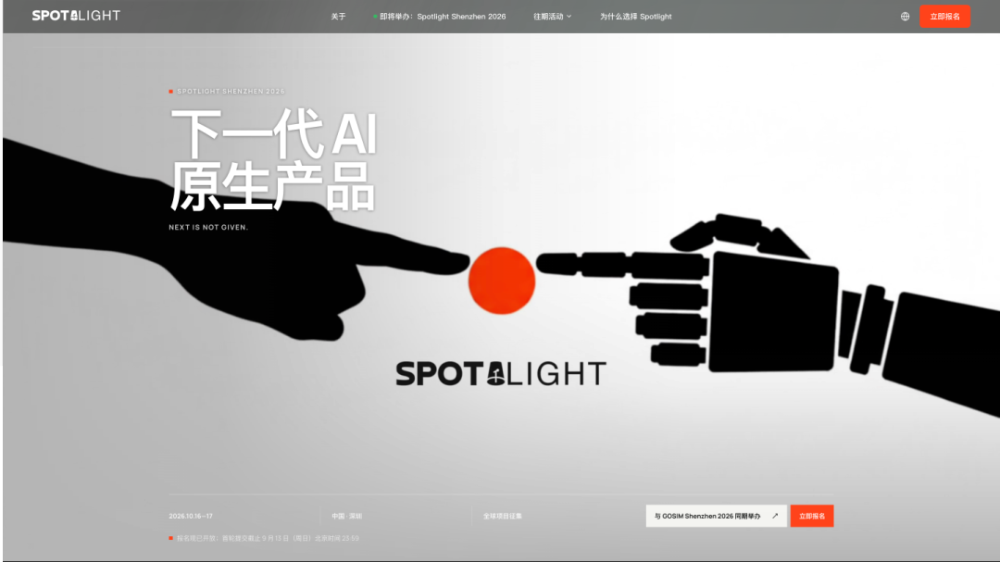
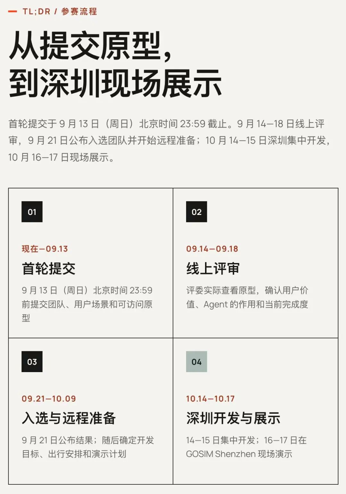
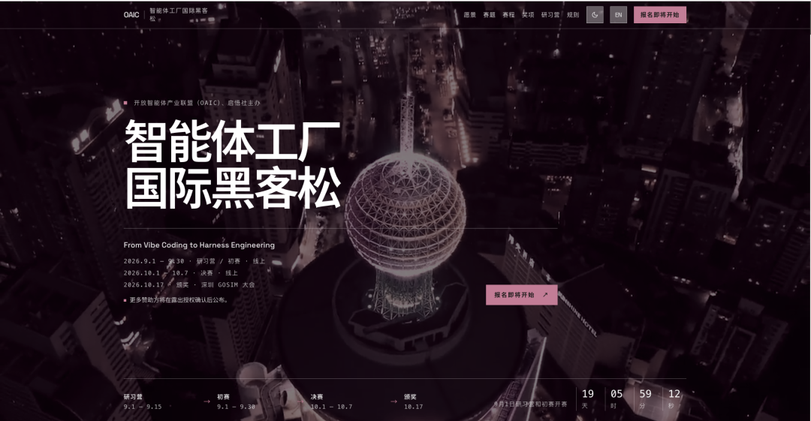
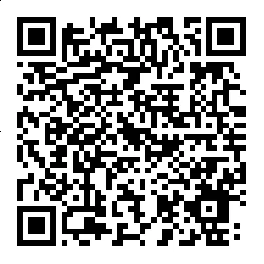
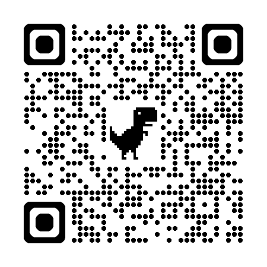

# GOSIM Spotlight Shenzhen 2026 全球 AI 项目火热征集中，10 月深圳见！

> **一句话摘要**：GOSIM Spotlight 是 GOSIM 面向全球创新产品打造的重要板块，**寻找能够定义新品类、重写交互规则、具备全球发展潜力的下一代 AI 原生产品**。**首轮提交 9 月 13 日截止**，10 月 16–17 日深圳 GOSIM 大会现场加速与发布。在线筛选阶段，**一部手机就够了**。

---

## 目录

- §1 · 何为 GOSIM Spotlight Shenzhen 2026？
- §2 · 为何 GOSIM Spotlight 值得参加？
- §3 · 如何参赛？
- §4 · 首轮提交截止 9 月 13 日，报名从速！
- §5 · 同期赛事与大会入口

---

10 月 16 日-17 日，**GOSIM Shenzhen 2026** 将在中国深圳举办。作为 GOSIM 面向全球创新产品打造的重要特色板块，**GOSIM Spotlight Shenzhen 2026** 现面向全球产品创造者开放征集，寻找能够定义新品类、重写交互规则，并具备全球发展潜力的下一代 AI 原生产品。

**项目报名地址**：<https://spotlight.gosim.org/shenzhen2026/>

---

## §1 · 何为 GOSIM Spotlight Shenzhen 2026？

本次 **GOSIM Spotlight Shenzhen 2026** 落地同时具备芯片、传动、本体制造、供应链与算法团队的深圳，作为 **GOSIM Shenzhen 2026** 的重要组成部分，将与 **6 大主题论坛、编程黑客松、互动创新展区**等活动联动，汇聚全球开源 AI 专家、行业领袖与**千名参会者**，成为 2026 年开源 AI 创意领域的核心展示窗口。

今年 Spotlight 以**面向消费者的 Agent 应用、用户体验与设备形态**为主题，面向全球产品创造者搭建全球前沿创意交流展示平台，挖掘并孵化**围绕 Agent 原生系统和新型人机交互展开的 AI 原生产品**；同时为优秀创作者提供全球曝光机会，链接行业资源与国际社群，助力开源 AI 创意生态的发展与繁荣。

### 从"功能叠加"到"品类重构"

当前大多数 AI 产品，本质是在既有应用架构里嵌入模型能力：用户仍然需要主动打开应用、在不同应用之间切换、面对固定菜单和页面，Agent 更像一个附加功能，而非系统核心。

> 当 AI Agent 不再只是设备里的一个应用，而是成为产品和操作系统的核心，**下一代个人计算与人机交互应该是什么样**？

Spotlight 寻找的不是又一个接入模型的应用，不是最复杂的硬件，而是**能够建立新品类、重写交互规则，并具备全球发展潜力的 AI 原生产品**。

Spotlight 想推动从"功能叠加"到"品类重构"的转变，寻找的产品方向需具备更加自然的交互：

- **AI 成为产品和系统的核心**
- **Agent 主动理解并完成任务**
- **Agent 统一调度服务、工具和设备**
- **根据用户意图动态生成或调整交互**
- **Agent 能力在不同设备和环境之间迁移**
- **比拼产品价值、体验、系统完成度与实现能力**
- **重新定义产品边界与使用方式**

---

## §2 · 为何 GOSIM Spotlight 值得参加？

Spotlight 不仅是开放一次项目征集，而是希望为真正有产品判断、有技术能力、有创造力的团队，**提供一条从产品概念、原型验证到全球发布的加速路径**，帮助有潜力的团队走得更远。

### ① 精心选拔 20 个左右最具代表性的入选项目

入选者将受邀参加**深圳现场加速活动**，进行展示，不仅能与顶尖同行深度交流，更是让产品进入全球技术社区视野的机会。（实际入选项目数量根据报名质量、场地与支持能力确定。）

### ② 现场活动支持

组委会将根据入选项目的关键缺口，协调必要的软件、设备整合、原型制作和发布资源。入选项目将获得以下现场支持：

| 支持类型 | 具体内容 |
|---|---|
| 💰 **原型补助** | 每个入选项目最高 **100 美元等值报销** |
| 🛠️ **软件资源** | 模型额度、开发工具和软件工厂支持 |
| 👨‍🏫 **技术辅导** | 助教、工程师和现场技术指导 |
| 🖨️ **原型制作** | 3D 打印、基础结构件和装配空间 |
| 🏢 **开发场地** | 深圳办公室或指定协作空间 |
| 🎤 **展示辅导** | 产品叙事、演示流程和现场展示优化 |

### ③ 现场项目指导

组委会将根据项目状态，对不同入选项目提供现场安排指导：

| 项目状态 | 现场指导重点 |
|---|---|
| 已有完整产品 | 测试、提高可靠性、打磨体验和优化发布 |
| 有交互原型但缺软件 | 获得软件工程、Agent OS 和技术辅导 |
| 有软件但缺设备形态 | 使用现有设备、3D 打印或结构件完成产品形态设计 |
| 设计能力强但技术不足 | 提供助教、工程师和技术指导 |
| 技术能力强但产品表达不足 | 提供产品定位、叙事和发布辅导 |

> ⚠️ 组委会仅仅提供指导与协助，不承诺为每个项目完整代做软件或硬件。参赛团队仍需对最终成果负责。

### ④ 全球传播与后续机会

优秀项目将有机会获得 GOSIM 社区推广、媒体曝光、后续产品打磨和孵化支持，进一步发展成为开源项目、创业项目或商业产品。

---

## §3 · 如何参赛？

### 参赛方式：两条路径

| 路径 | 说明 |
|---|---|
| 🅰️ **Agent OS 方向** | 使用官方 Agent OS 或相关能力构建完整的 Agent 原生产品体验 |
| 🅱️ **开放创新方向** | 使用其他技术方案，但必须体现系统级或 Agent 原生交互 |

> 💡 Agent OS 在 Spotlight 的定位是"重点平台与推荐基础"，但**不强制**所有项目使用指定系统。作品需要展示 Agent 如何改变传统产品流程、系统能力和交互结构。Agent OS 专项奖是否设置，由组委会在奖项方案确认后另行公布。

选择 Agent OS 路径的项目，可以获得**七项平台能力**的直接支撑：

| 序号 | 平台能力 |
|---|---|
| 1 | 自然语言语音交互 |
| 2 | 摄像头与麦克风和屏幕传感器的多模态理解 |
| 3 | 对用户偏好和历史任务的长期记忆 |
| 4 | 搜索与应用、网络服务和硬件的工具调用 |
| 5 | 根据任务动态生成或调整界面 |
| 6 | 在手机与手表和机器人之间迁移体验的跨设备运行 |
| 7 | 主动提醒、规划与执行的主动服务能力 |

### Spotlight 真正关注的 3 个问题

- **产品体验是否成立**？
- 软件、模型、硬件和交互是否形成统一的产品？
- 用户是否能够真正体验到你的想法？

### 作品应优先体现的 5 个特征

| 特征 | 说明 |
|---|---|
| 📱 **面向消费者** | 服务个人用户，而非以企业后台工具为主 |
| 👀 **移动优先** | 优先考虑手机、手表和其他随身或带屏设备 |
| 🤖 **Agent 原生** | Agent 是核心体验，不是普通应用附加的聊天窗口 |
| 🎬 **可交互** | 必须展示完整的用户流程，而不只是文字构想 |
| ✅ **可实现** | 应能够在有限时间内完成原型或明确验证核心体验 |

### 8 个推荐方向（不限于）

| 方向 | 示例 |
|---|---|
| 新一代智能终端 | AI 手机、手表、机器人、个人智能设备 |
| 环境与跨设备智能 | 家庭、桌面、汽车、空间与跨设备 Agent |
| AI 原生软件系统 | 重新设计购物、旅行、学习、娱乐、创作等工作流 |
| AI 教育 | 学习灯、视觉辅导设备、个性化学习系统 |
| AI 陪伴 | 桌面机器人、宠物机器人、长期个人助手 |
| AI 穿戴 | 手表、眼镜、智能徽章及其他随身设备 |
| AI 生活 | 健康、运动、家庭和日常事务管理 |
| AI 娱乐 | 音乐、视频、游戏与内容探索 |

### 3 类接受的产品形态

| 形态 | 说明 |
|---|---|
| 🔧 **自创硬件形态** | 自主设计产品外形、交互和设备形态，可结合 3D 打印、激光切割或定制结构 |
| 📲 **现有设备整合或改造** | 重新组合或改造手机、智能手表、Rabbit R1、机器人及其他设备的能力与形态 |
| 💻 **纯软件产品** | 当核心体验不依赖新硬件时，通过应用、网页、桌面界面或跨设备服务实现 |

> ⚠️ 硬件或设备整合可以体现产品系统能力和实现难度，**但不会自动构成评分优势**。Spotlight 会先验证产品判断和核心体验，因此在线上筛选阶段，**一部手机就够了**——手机、网页、Figma、模拟器和桌面应用都可以作为第一阶段的原型载体。参赛者不需要提前购买昂贵硬件，但必须证明核心产品体验清晰、可信且可以实现。
>
> 形态问题等入选之后，进入深圳封闭加速阶段，组委会会提供 3D 打印、基础结构件、装配空间和必要的设备整合支持。为进一步降低参赛门槛，组委会还计划准备一套**原型工具包**：手机网页外壳用于快速模拟移动产品，手表界面外壳展示穿戴设备交互，带屏设备外壳模拟桌面终端和个人智能设备。附加 Agent OS 示例项目和软件工厂指南，能力较弱的参赛者可以在模板基础上修改，能力较强的参赛者可以自主开发完整产品。
>
> 因此，即使你目前只有一个高可信度的交互原型，**也不要因为"产品还不够完整"而放弃提交**。

---

## §4 · 首轮提交截止 9 月 13 日，报名从速！

### 参赛流程 5 阶段

| # | 阶段 | 关键节点 |
|---|---|---|
| 01 | **首轮提交** | 提交核心材料 + 回答 8 道必答题 |
| 02 | **筛选** | 评委在线评审 + 公布入选名单 |
| 03 | **深圳开发与展示** | 集中开发 / 现场展示 / 公开发布 |
| 04 | **现场展示** | 与 GOSIM 主会场同步的首次正式发布 |
| 05 | **全球现场发布** | 面对产业、开发者和国际开源社区 |

### 5 项核心提交材料

1. **品类命题**：说明要建立什么新品类、为什么必须在当今出现
2. **Agent 核心说明**：阐述 Agent 如何从根本上改变产品能力与交互结构
3. **可运行证据及可交互原型**：可以是真实设备、应用、网页或高可信交互原型
4. **产品影片**（建议 1 分钟左右）：呈现核心体验、技术可信度与产品气质（最终时长要求以正式报名表为准）
5. **系统路线图**：从当前版本到完整产品的工程、产品与市场路径

> ⚠️ **只有文字说明、没有任何可视化或交互验证的项目，原则上不进下一轮。**

### 8 道必答题

1. 你希望建立什么新品类？
2. 为什么这个产品必须在今天出现？
3. 为什么它不能只是一个普通应用？
4. Agent 在产品中承担什么不可替代的作用？
5. 目前有哪些可运行或可验证的产品证据？
6. 如果入选，团队能在深圳阶段完成什么？
7. 产品未来如何扩展并服务更大的市场？
8. 需要组委会提供哪些关键支持？

### 开源要求

Spotlight 不强制 01 阶段开源，但需要**可验证原型**。入选之后原则上开放核心代码、原型或主要成果。全球现场发布时应以公开仓库、技术说明或明确的成果发布方式接受社区验证。（涉及第三方商业代码、硬件设计或个人隐私的内容，可以提前申请合理豁免。）

### 3 大评审维度

#### A. 主观评分占 60%

| 维度 | 重点 |
|---|---|
| **品类价值与市场判断** | 是否提出重要、清晰且有扩展潜力的产品命题 |
| **Agent 原生程度** | Agent 是否真正成为不可替代的产品核心 |
| **产品体验与系统设计** | 软件、硬件、模型和交互是否形成统一产品 |
| **全球影响力与扩展潜力** | 是否能够服务更大的市场并产生长期价值 |

#### B. 客观完成度占 40%

| 维度 | 重点 |
|---|---|
| **公开可运行、可验证** | 是否存在稳定、可信的产品证据 |
| **系统整合** | 软件、模型、服务与设备是否完成有效整合 |
| **技术难度、可靠性与延展性** | 是否解决关键技术问题并具备继续发展的基础 |
| **整体完成度与团队交付能力** | 是否形成完整产品并在规定时间内完成交付 |

#### C. 最终评选与发布重点（7 项）

| # | 维度 | 重点 |
|---|---|---|
| 1 | 品类命题 | 是否定义了新的产品边界 |
| 2 | 产品体验 | 是否解决真实问题，使用过程是否自然 |
| 3 | Agent 价值 | Agent 是否真正改变传统交互流程 |
| 4 | 系统完成度 | 软件、模型、设备和交互是否形成完整产品 |
| 5 | 实现可靠性 | 产品是否可运行、可信且稳定 |
| 6 | 全球潜力 | 是否具备扩展市场与持续发展的可能 |
| 7 | 发布效果 | 是否能够清楚、有吸引力地表达产品价值 |

> **Spotlight 全球 AI 原生产品选拔与加速计划现已开启**，项目提交地址：<https://spotlight.gosim.org/shenzhen2026/>

---

## §5 · 同期赛事与大会入口

| 类型 | 链接 |
|---|---|
| 🎯 **Spotlight 项目提交** | <https://spotlight.gosim.org/shenzhen2026/> |
| 🏆 **智能体软件工厂国际黑客松** | <https://create.gosim.org/factory26/> |
| 🎤 **讲师申请通道** | <https://cfp.gosim.org/> |
| 🎟️ **早鸟观众票** | <https://www.bagevent.com/event/gosimshenzhen2026> |

### 黑客松报名即将开启

大会同步设置了黑客松赛道，其中**智能体工厂国际黑客松**将邀请团队或个人开发者用统一网关发放的 Token，使用所有的 Agents 参加进行亲手搭智能体、跑工作流、抓 Bug，做出能把真实的企业业务落地的软件。

### 讲师申请通道最后几天开放

欢迎您加入讲师队伍，打开链接报名：<https://cfp.gosim.org/>

### 限时早鸟观众票同步抢购中

> 如果你想来现场听总计百余位讲师的分享、并和全球开发者面对面，早鸟票正在限时优惠，先到先得，**售完即止**。

购票链接：<https://www.bagevent.com/event/gosimshenzhen2026>（扫码直达购票页面）

扫码或点击阅读原文查看更多官网信息：

---

## 附录 A · 兄弟赛事速览

GOSIM Shenzhen 2026 由三场赛事组成（**Agent Observer** 是第三场）：

| 赛事 | 主题 | 报名入口 |
|---|---|---|
| **智能体软件工厂（Agentic Software Factory）黑客松** | 软件工程可信交付 | <https://create.gosim.org/factory26/> |
| **Spotlight 全球 AI 原生产品征集** | 新品类 AI 产品加速 | <https://spotlight.gosim.org/shenzhen2026/> |
| **巡天智能体（Agent Observer）黑客松** | 仿真巡天观测决策 | <https://bh3gei.github.io/agent-observer/register> |

> 📚 本仓库（`AgentObserver/`）的 Agent Observer 本地化资料见 `references/survey26_*.md`；中文推广长文见 `articles/agent-observer-promo.md`；兄弟赛事 Factory 的本地化版本见 `marketing/gosim_factory_hackathon_intro.md`。

---

## 附录 B · 图片版权与署名

| 配图位置 | 文件 | 授权 / 来源 |
|---|---|---|
| 文首装饰横幅 | `spotlight-img-01.jpg` | GOSIM Spotlight Shenzhen 2026 官方公众号 |
| §0 项目提交引导 | `spotlight-img-02.jpg` | GOSIM Spotlight Shenzhen 2026 官方公众号 |
| §4 参赛流程图（5 阶段） | `spotlight-img-03.jpg` | GOSIM Spotlight Shenzhen 2026 官方公众号 |
| §5 现场活动支持图 | `spotlight-img-04.jpg` | GOSIM Spotlight Shenzhen 2026 官方公众号 |
| §5 早鸟票引导图 | `spotlight-img-05.jpg` | GOSIM Shenzhen 2026 官方公众号 |
| §5 官方二维码 | `spotlight-img-06.jpg` | GOSIM Shenzhen 2026 官方公众号 |

---

*本仓库维护者：cnbison · 与 Agent Observer 推广长文（`articles/agent-observer-promo.md`）+ Factory 兄弟赛事（`marketing/gosim_factory_hackathon_intro.md`）并列，构成 GOSIM Shenzhen 2026 三场赛事的完整本地档案*
