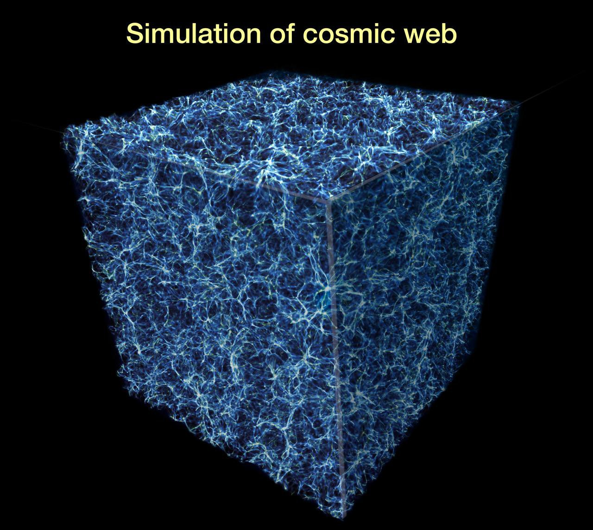
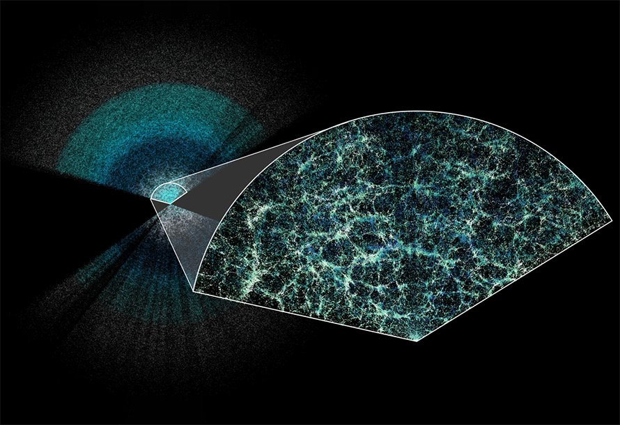
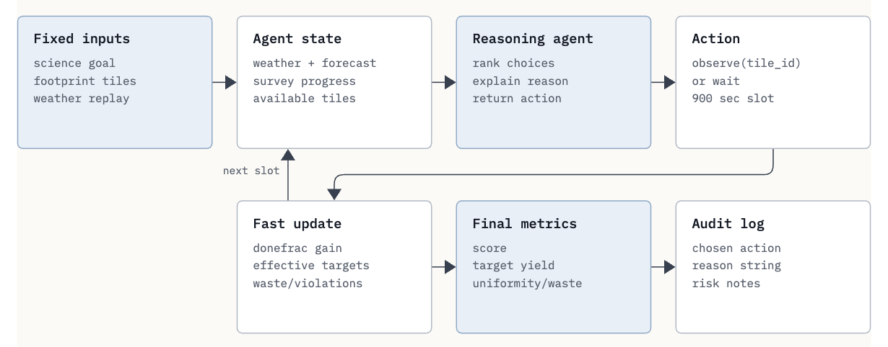
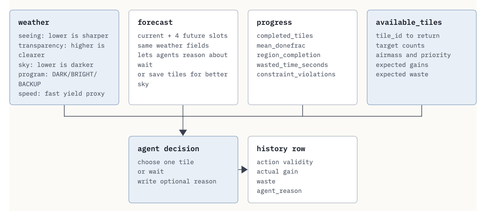
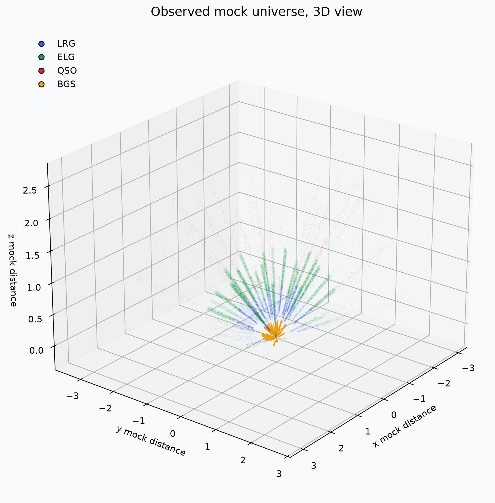
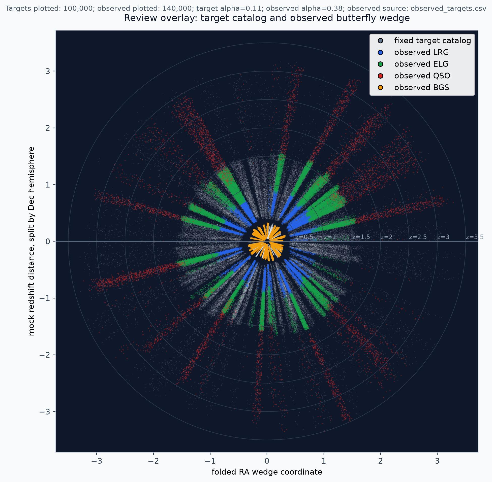
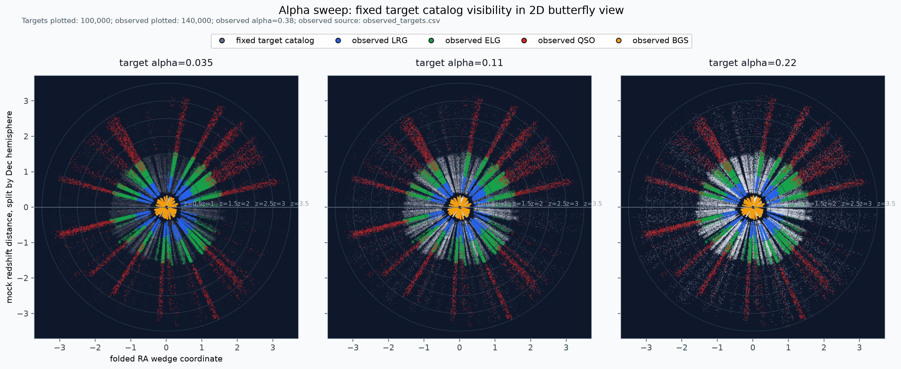
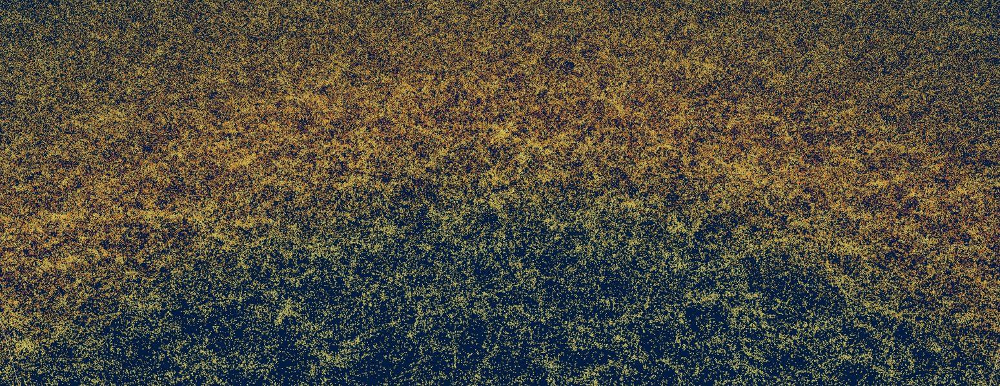

# GOSIM Hackathon · Open Agent Observer Challenge（参赛者简报）

> 原文 PDF：[`marketing/gosim_survey_agent_hackathon_intro.pdf`](gosim_survey_agent_hackathon_intro.pdf)（A4 / 12 页 / 英文）
> 中文译版 PDF：[`marketing/gosim_survey_agent_hackathon_intro_cn.pdf`](gosim_survey_agent_hackathon_intro_cn.pdf)（10.8 MB）
> 出品方：GOSIM · 副标题「A GOSIM Hackathon for Intelligent Survey Operations」
> 渲染引擎：WeasyPrint 69.0
> 本仓库整理时间：2026-09-18

> **本文保留英文原文**（与官方 PDF 一致），配 8 张配图与版权标注。文首附中文摘要、章节对照，方便中文参赛者定位。

---

## 中文摘要

GOSIM 在 2026 年发起 **Open Agent Observer Challenge**——让参赛者**当一晚上天文学家的主值观测员**：每 900 秒（15 分钟）做一次决定，把望远镜对准哪个天区。

**为什么这件事重要**：现代巡天望远镜（DESI、Rubin/LSST 等）每晚产生海量观测数据，决定「下一束光看哪里」本身就是科研产出的一部分。把这个决策自动化、并可解释、可审计，是 AI for Science 落地的一个重要切面。

**怎么做**：组织方提供
- 固定的 **Survey Mission Card**（科学目标 + 巡天区域 + 时间预算 + 站点 + 项目集）；
- 公开的 **tile 目录、天气回放、开发场景、可视化报告**；
- 共享的 **评测仿真器 + 评分公式**。

参赛者只需提交**一个 agent 项目**——接收当前 snapshot，返回 `observe(tile_id, program, reason)` 或 `wait`。**评测时所有参赛者跑同一份天气回放 + 同一份计分规则**，最终按分数排名。

**核心挑战**（详见 §2–§9）：
1. 天气变化（seeing / transparency / 天空亮度）；
2. 目标可见性随时间变化（airmass / sky position）；
4. 巡天策略之间要兼顾 DARK / BRIGHT / BACKUP 三档条件；
3. 大尺度覆盖必须均匀，不能厚此薄彼；
5. 高优先级 tile vs 差一次曝光就完成的 tile vs 覆盖落后的 region——三者竞争同一批时隙；
6. 一次糟糕的战术决定会消耗真正的观测时间，改变后续排程；
7. 夜间操作既要「有效」也要「可解释」。

**与中文资料仓库的关系**：本 md 仅是 PDF 的本地化版本，订阅与复核以官方 PDF 为准。参赛者真正的策略设计请阅读 [references/survey26_brief.md](../references/survey26_brief.md)（赛题简报中文版）与 [agent-observer-starter-kit-ANALYSIS.md](../agent-observer-starter-kit-ANALYSIS.md)（入门包源码深度分析）。

---

## Table of Contents · 目录

| § | 英文标题 | 中文译名 |
|---|---|---|
| 1 | Survey telescopes and cosmology | 巡天望远镜与宇宙学 |
| 2 | Why survey operations are hard | 为什么巡天操作很难 |
| 3 | What the human leading observer does | 人类主值观测员做什么 |
| 4 | Why Agent Observers matter now | 为什么 Agent Observer 现在很重要 |
| 5 | How the challenge is run | 比赛如何运行 |
| 6 | Planning horizons: long, middle, and short term | 规划的时间尺度 |
| 7 | Participant job | 参赛者任务 |
| 8 | The four important aspects behind every decision | 每个决策背后的四个要素 |
| 9 | Weather-aware replanning is the core stress test | 天气感知重规划——核心压力测试 |
| 10 | Result visualization | 结果可视化 |
| 11 | Participant workflow | 参赛者工作流 |
| 12 | How scoring works | 评分如何计算 |
| 13 | Scored scope | 评分范围 |
| 14 | Open science design | 开放科学设计 |
| 15 | Why this matters | 为什么这件事重要 |
| 16 | Public science references | 公开科学参考文献 |

---

## Cover · 封面

> **GOSIM HACKATHON · PARTICIPANT BRIEFING**
>
> # Open Agent Observer Challenge
> ### A GOSIM Hackathon for Intelligent Survey Operations
>
> Build a future agent observer for survey nights: read the sky state, reason like a leading observer, and choose the next observation **every 900 seconds**.

---

## 1. Survey telescopes and cosmology

A survey telescope maps large areas of the sky in a systematic way. Instead of spending the whole night on a single object, a survey observes thousands of sky fields over many nights and builds statistically powerful samples of galaxies, quasars, stars, and other sources.

Cosmology depends on these large, uniform, well-calibrated samples. Wide-field surveys reveal the large-scale structure of the Universe, constrain the expansion history, support dark-energy measurements, and connect galaxy evolution to cosmic time. **The observing plan shapes the final science sample.**



> **FIG 1.1** — Wide-field surveys are ultimately sampling the cosmic web: galaxies trace large-scale structure shaped by dark matter.
> Source: <https://science.nasa.gov/asset/hubble/probing-the-cosmic-web>
> Credit: **NASA Science / Hubble, Probing the Cosmic Web**. NASA media and page attribution retained.

A spectroscopic survey adds a third dimension: redshift. With sky position plus redshift, a survey can build a three-dimensional map of cosmic structure. **DESI** is a concrete public example of this goal: it measures spectra for large samples of galaxies and quasars to map the expanding Universe and study dark energy.

---

## 2. Why survey operations are hard



> **FIG 1.2** — DESI's public science motivation: spectra of galaxies and quasars build a three-dimensional map of cosmic structure and expansion history.
> Source: <https://desi.lbl.gov/2024/04/04/first-cosmology-results-from-desi>
> Credit: **Claire Lamman / DESI collaboration**; custom colormap package by cmastro. Used with source and credit for educational hackathon materials.

- **Weather changes** the value of a 900-second exposure through seeing, transparency, and sky brightness.
- **Target visibility** changes with time through airmass and sky position.
- **Different programs** prefer different sky conditions, such as DARK, BRIGHT, and BACKUP modes.
- **The footprint** must be completed broadly and evenly to support reliable science analyses.
- **Every observing slot** forces a trade-off among high-priority tiles, nearly complete tiles, and under-covered footprint regions.
- **A single poor tactical choice** spends real observing time and changes the future plan.
- **Night operations** require decisions that are both effective and explainable.

---

## 3. What the human leading observer does

> 📘 **Note for non-astronomers.** Every term in this section answers one practical question: *how visible and valuable is a given target right now?*

| 术语 | 解释 |
|---|---|
| **Seeing** | how much atmospheric turbulence blurs the image; lower is better. |
| **Transparency** | how clear the atmosphere is along the line of sight; higher is better. |
| **Sky brightness** | the background glow of the night sky (moonlight, twilight, light pollution); darker is better for faint targets. |
| **Airmass** | how much atmosphere a target's light must pass through, defined as 1 at the zenith (directly overhead); it grows as the target sinks toward the horizon, so lower is better, and it changes through the night as targets rise and set. |
| **DARK / BRIGHT / BACKUP** | observing programs matched to sky conditions: DARK spends the best dark time on faint targets; BRIGHT tolerates background glow, focusing on bright targets but not faint ones; BACKUP keeps the telescope useful in poor conditions. |
| **Tile** | one patch of sky the telescope observes in a single pointing; the survey divides the footprint into tiles, and every observing decision picks one tile at a time. |
| **Footprint** | the full sky area the survey must cover, completed broadly and evenly. |
| **High-priority / nearly complete / under-covered tiles** | respectively, tiles with extra scientific weight, tiles one exposure away from done, and regions lagging behind in the footprint; all three compete for the same observing slots. |

Together these terms define **target visibility in the broad sense**: the atmosphere sets image quality (seeing, transparency, sky brightness), geometry sets whether a target is up at all (airmass, sky position), the program mode decides which targets fit the current conditions, and the survey state decides which tiles matter most (priority, completion, footprint balance). **A good observer reads all of these before spending the next 900-second slot.**

On a real survey night, the leading observer answers the challenges above through a repeating set of duties:

1. **Night strategy:** interpret the science goal and decide the tactical emphasis for the night.
2. **Weather interpretation:** read seeing, transparency, sky brightness, and short-term forecast.
3. **Program selection:** decide when the night favors DARK, BRIGHT, or BACKUP observations.
4. **Candidate filtering:** pick out the currently visible, legal, and useful sky tiles.
5. **Tile ranking:** trade science yield, priority, airmass, footprint balance, and time waste.
6. **Completion management:** finish tiles when completion value beats overshoot cost.
7. **Replanning:** react to disruption blocks and shifting observing efficiency.
8. **Quality monitoring:** use fast validation signals to calibrate future decisions.
9. **Reason logging:** explain why the observer chose this action in this slot.

---

## 4. Why Agent Observers matter now

The duties above are demanding even for experienced observers: they require judgment under uncertainty, **every 900 seconds, all night long**. Modern AI systems now create a path toward assistants that read the state, call computational tools, reason with physical constraints, propose plans, monitor quality, and explain each choice.

The goal is **an agent observer that can participate in real survey operations**: reading the same state as a human leading observer, proposing the next move, and explaining why.

This hackathon offers a focused benchmark: participants design the observer logic system, while the organizers provide the mission definition, sky tiles, observing constraints, weather scenarios, simulator, and evaluation protocol.

---

## 5. How the challenge is run

This document describes the challenge design and the reasoning concept behind it. Each challenge instance starts from a **Survey Mission Card**. The card describes the science goal, footprint size, time budget, telescope site, available programs, target classes, observing constraints, and scoring rule. The Survey Mission Card and the public development data will be released to participants before the hackathon begins.

- **Mission definition:** what sky area to cover, which targets matter, and how much time is available.
- **Telescope / site:** latitude, visibility limits, slot length, and airmass constraint.
- **Public development data:** tile catalog, example weather scenarios, initial states, and visual reports.
- **Final evaluation data:** organizer-provided weather replays run through the same simulator.
- **Participant product:** an agent observer that reads state and returns an observing action.

### Same exam for every participant

Evaluation fixes one shared scenario — the overall survey plan, the per-night seeing and weather replay, ad-hoc observing requests, and predictable mid-term disruptions such as rain, forest fire smoke plumes or scheduled rocket launches — together with a single scoring rule. Working from this information, the agent produces the next observing plan every 900 seconds.

> **FIG 5.1** — The data flow: fixed inputs feed the agent state, the reasoning agent returns an action, the simulator updates fast metrics, the run yields final metrics and a complete audit log.



---

## 6. Planning horizons: long, middle, and short term

Real survey operations plan on three timescales, and this challenge maps onto them deliberately:

### Long term (whole survey)

The organizers provide the overall survey plan — which sky areas and which targets to observe — as part of the mission card, while the agent manages that plan in flight. Final scoring includes survey completeness and completion quality.

### Middle term (month, week, day)

A flexible plan built from completion progress and forecast conditions, absorbing predictable disruptions (weather systems, forest fire smoke plumes, scheduled launches) and newly inserted observing requests. **This layer belongs to the evaluation scope; the agent should manage the plan and observation window.**

### Short term (tonight, every 900-second slot)

Immediate tactical adjustments based on the middle-term plan, driven by real-time measured seeing and transparency. **This layer is the focus of the scored benchmark.**

> 💡 From Section 7 to 10, the document presents a reference implementation to illustrate a sample design. These examples are intended to guide your thinking, **not to constrain your creativity**. Please remember that the authoritative input/output formats and the interface contract are strictly defined by the Survey Mission Card.

---

## 7. Participant job

The participant job is to submit **a concrete, reproducibly runnable agent project**. The programming language is not restricted, as long as the project implements the observer interface: the simulator repeatedly hands your agent the current situation, and the agent returns next action (like "observe" or "wait").

Every 900-second slot, the agent should return one observing plan in a format like:

```python
return {"action": "observe", "tile_id": 100123, "plan": "DARK",
        "reason": "good weather and highest useful gain"}
```

which gives the basic command for the next move. The **reason field** is in free form, its content is not restricted.

In the hackathon, we demand **a full trace logging**: the project must save the complete record of every agent turn into files, including but not limited to each turn's input, output, tool calls, and tool results for organizer review.

**Submit:** the agent project + a short note explaining the observer architecture.

---

## 8. The four important aspects behind every decision

Every slot, the agent should be provided with information about **four aspects** — weather, forecast, progress, and available tiles. The agent weighs all four together rather than reacting to any one of them alone. The diagram below shows how these inputs are structured.

> **FIG 8.1** — The content dictionary is small enough for non-astronomers to inspect and reason about. The **donefrac** here refers to survey completion of each single tile: 0 means just started, 1 means complete.



The agent should handle several recurring situations:

- In **excellent dark conditions**, it should use the slot for high-value faint targets.
- In **marginal conditions**, it may finish nearly complete tiles or switch to more suitable programs.
- When **the forecast improves soon**, it can preserve the best dark-time targets.
- When **one footprint region lags behind**, it can accept a slightly lower immediate yield to keep the survey balanced.

> **How to weigh these factors is left to each participant's design.**

---

## 9. Weather-aware replanning is the core stress test

The weather replay includes deterministic disruption blocks (rain, forest fire, rocket launch, etc.). During poor conditions, **a naive agent may waste time, wait too much, or spend good targets in bad sky**. A stronger agent can:

- use the forecast,
- switch programs when appropriate,
- finish near-complete tiles, and
- preserve valuable dark-time targets for better conditions.

---

## 10. Result visualization

The test data also contain a deterministic mock target-coordinate catalog. Each tile's target counts are bound to fixed mock coordinates by seed, tile_id, and target class. After an agent run, the simulator converts completed tile fractions into an observed-target map.

The map can show how many mock galaxies and quasars the agent observed. The plotted coordinates show RA, Dec, and mock redshift for result visualization.

- **Three-dimensional plots** show the observed mock universe as a spatial sample.
- **Two-dimensional butterfly plots** show sky position folded with mock redshift, DESI-style.
- **Review overlays** place the fixed target catalog in a tunable alpha background and the participant's observed sample in color.
- **Alpha sweep figures** compare multiple target-layer transparencies side by side for judging and presentation.

Different observer policies produce different visible cosmic-structure maps. The visualization helps teams explain strategy, footprint balance, and missed regions. The map is a benchmark visualization layer; the scored loop remains the planning task.

The reference implementation includes utilities that regenerate these figures for any agent run.



> **FIG 10.1** — Example challenge output from the built-in balanced observer. The three-dimensional view keeps the spatial mock-universe sample visible for presentation.



> **FIG 10.2** — Example review overlay. Gray points show the fixed target catalog with target alpha 0.11; colored points show the participant observed sample with observed alpha 0.38.



> **FIG 10.3** — Example alpha sweep. The three panels compare target alpha values 0.035, 0.11, and 0.22 while keeping the observed layer fixed.



> **FIG 10.4** — A DESI Data example of how sky coordinates and redshift become a map-like view; the challenge's observed-universe map is a lightweight benchmark analogue.
> Source: <https://data.desi.lbl.gov/doc>
> Credit: **David Kirkby / DESI collaboration**. DESI data are licensed under **CC BY 4.0**.

---

## 11. Participant workflow

1. **Read** the Survey Mission Card.
2. **Study** the public development scenarios and their visual reports.
3. **Prototype** an agent against the observer interface described above.
4. **Evaluate** it on the development scenarios, and inspect the trace logs and observed-universe maps to understand its behavior.
5. **Submit** the agent project, the observer architecture note, and the full trace logs of every agent turn.

> The reference implementation ships a starter template and concrete commands for each step; see the participant guide in the repository.

---

## 12. How scoring works

The score is computed by the organizers after the run. It rewards weighted effective targets and penalizes uneven footprint coverage, wasted time, rule violations, and incomplete high-priority tiles.

```
score = science_score
      − uniformity_penalty
      − wasted_time_penalty
      − violation_penalty
      − incomplete_priority_penalty
```

Your agent may use any internal decision logic; shaping that logic to anticipate the scoring terms is one natural strategy, since a good agent ends up trading immediate yield against completion, uniformity, weather risk, and operational discipline.

---

## 13. Scored scope

- **Primary evaluation:** short-term observation planning, scored as described in §12.
- **Middle-term planning:** part of the intended evaluation scope, enabled at organizer discretion as the mission cards evolve.
- **Validation extensions:** real DESI log replay, z > 5 QSO planning, and LBG planning as separate mission cards.

**Control split:**

| 参赛者可控 | 组织方可控 |
|---|---|
| agent policy, reasoning logic | simulator, data, weather replay, constraints, score |

---

## 14. Open science design

This challenge is built so that its results can be trusted, checked, and extended by the community:

- **Reproducible:** fixed seeds, fixed data, fixed score — any submission can be rerun and verified by a third party.
- **Inspectable:** the state dictionary, run histories, and the full per-turn trace logs are all readable, so every decision can be audited after the fact.
- **Hard to overfit:** development weather and final evaluation weather are separated, so the score compares generalization rather than tuning to a known scenario.
- **Extensible:** the same observer-agent interface carries future mission cards — real survey-log replay, z > 5 QSO planning, LBG planning, or target-of-opportunity inserts — and the community is invited to propose new fixed datasets as follow-up tracks.

---

## 15. Why this matters

Intelligent telescope systems need more than model accuracy. They need to reason under changing conditions, explain decisions, respect constraints, and remain useful to scientists. This hackathon gives the community a concrete place to build and compare those capabilities.

> **The goal is to make intelligent observing decisions testable, open, and scientifically grounded.**

---

## 16. Public science references

- DESI official site — <https://www.desi.lbl.gov/>
- DESI science overview — <https://www.desi.lbl.gov/science/>
- NASA Science image page, Probing the Cosmic Web — <https://science.nasa.gov/asset/hubble/probing-the-cosmic-web/>
- DESI first cosmology results image page — <https://www.desi.lbl.gov/2024/04/04/first-cosmology-results-from-desi-most-precise-measurement-of-the-expanding-universe/>
- DESI Data documentation and license — <https://data.desi.lbl.gov/doc/>

---

## 附录 · 版权与图片归属

| 图 | 出处 | 授权 |
|---|---|---|
| FIG 1.1 Cosmic Web | <https://science.nasa.gov/asset/hubble/probing-the-cosmic-web/> | NASA / Hubble（公共领域） |
| FIG 1.2 DESI 红移图 | <https://desi.lbl.gov/2024/04/04/first-cosmology-results-from-desi> | Claire Lamman / DESI collaboration；cmastro colormap；教育用 |
| FIG 5.1 数据流图 | GOSIM Agent Observer 官方 PDF（`assets/agent-observer/fig5.1.png`，用户提供） | GOSIM Agent Observer 团队 |
| FIG 8.1 内容字典 | GOSIM Agent Observer 官方 PDF（`assets/agent-observer/fig8.1.png`，用户提供） | GOSIM Agent Observer 团队 |
| FIG 10.1 3D 宇宙图 | GOSIM Agent Observer 参考实现 balanced observer | GOSIM Agent Observer 团队 |
| FIG 10.2 Review overlay | 同上 | 同上 |
| FIG 10.3 Alpha sweep | 同上 | 同上 |
| FIG 10.4 DESI 蝴蝶图 | <https://data.desi.lbl.gov/doc/> | DESI collaboration / David Kirkby · **CC BY 4.0** |

> 本 md 仅供中文资料仓库内部使用；PDF 原文版权归 GOSIM 与各图片原始权利人所有。