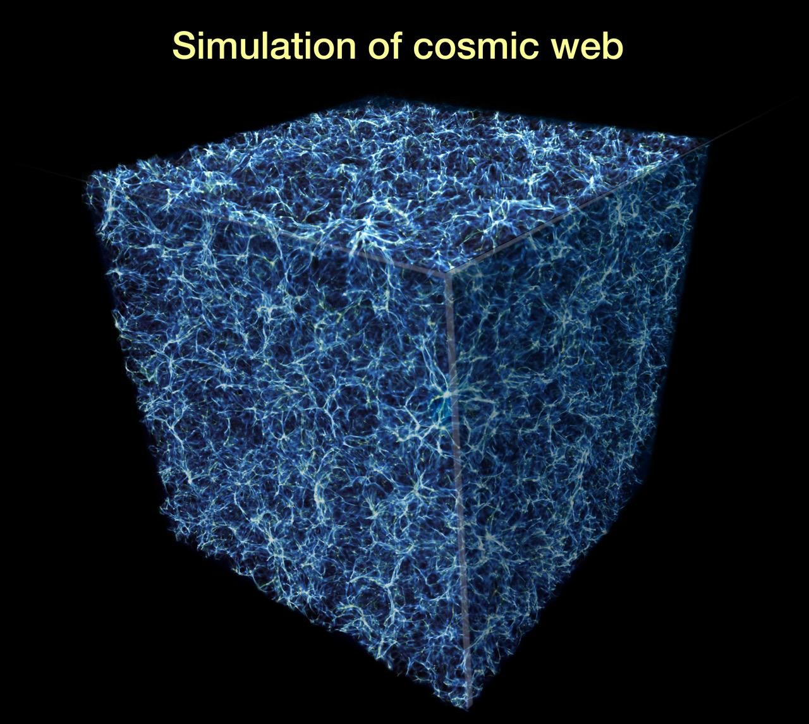
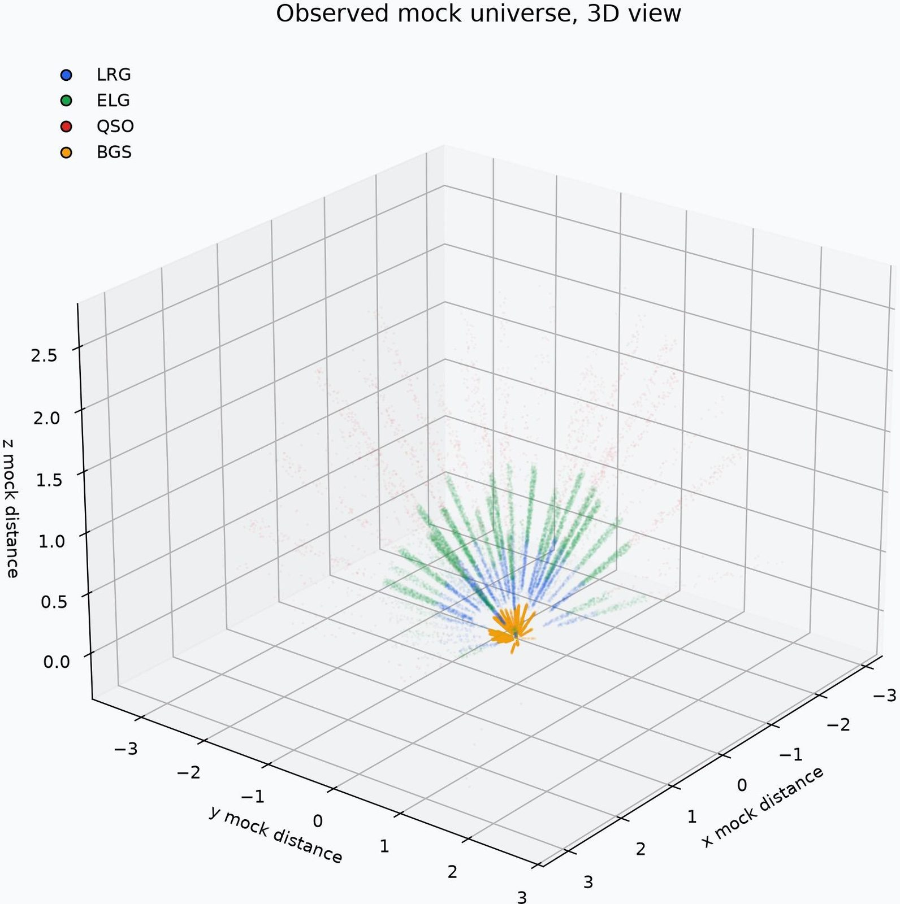

# 巡天智能体 · Agent Observer

> GOSIM 黑客松 · 智能巡天
>
> 为巡天之夜构建未来的观测智能体：读取天空状态，像主值观测员一样推理，每 900 秒选择下一次观测。
>
> 来源页面：<https://create.gosim.org/survey26/>

---

## 目录

- [活动切换（深圳黑客松系列）](#活动切换深圳黑客松系列)
- [主视觉与赛程时间线](#主视觉与赛程时间线)
- [01 · 愿景：构建智能巡天的开放基准](#01--愿景构建智能巡天的开放基准)
- [02 · 赛题：望远镜下一步该看向哪里](#02--赛题望远镜下一步该看向哪里)
- [03 · 如何参赛：三步加入挑战](#03--如何参赛三步加入挑战)
- [04 · 奖项：\$5,500 奖金池](#04--奖项5500-奖金池)
- [05 · 实时排名](#05--实时排名)
- [最终传输：把夜空的下一步，交给你写的智能体](#最终传输把夜空的下一步交给你写的智能体)

---

## 活动切换（深圳黑客松系列）

| # | 名称 | 别名 | 地点 |
|---|---|---|---|
| 01 | Agentic App 黑客松 | Agentic App | Shenzhen 2026 · Agentic App |
| 02 | 智能体工厂国际黑客松与大奖赛 | Agentic Factory | Shenzhen 2026 · OAIC |
| 03 | **巡天智能体** | **Agent Observer** | Shenzhen 2026 · Agent Observer（当前） |

**主导航：** 赛事说明 · 为什么 · 赛题 · 参赛 · 排行榜 · 登录 ↗

**语言：** 中文 / EN

**主行动按钮：** [立即报名 ↗](https://bh3gei.github.io/agent-observer/register)

---

## 主视觉与赛程时间线

<video src="../assets/agent-observer/survey-night-sky.mp4" poster="../assets/agent-observer/survey-cosmic-web-DYzNpylI.jpg" autoplay loop muted playsinline preload="metadata" style="width:100%;border-radius:8px;"></video>

> **Human judgment / machine speed / one shared sky**

### 赛程三阶段

| 阶段 | 时间 | 形式 |
|---|---|---|
| 01 · 线上培训 | 10 月 1–4 日 | 线上 |
| 02 · 线上比赛 | 10 月 5–7 日 | 线上 |
| 03 · 颁奖日 | 10 月 17 日 | GOSIM 深圳 |

> 📄 **赛题简报**：每个阶段做啥、怎么计分、要交什么、状态字典长什么样 —— 详见 [赛题简报](survey26_brief.md)（含 8 章完整说明：为什么 / 观测员职责 / 挑战赛制 / 规划尺度 / 参赛任务 / 计分 / 名词 / 时间线）。

---

## 01 / 愿景

### 构建智能巡天的开放基准

**主题：观测智能体 / 巡天策略**

我们让智能体接手：同样的天区、同样的天气与进度，由它给出下一个指向。

巡天望远镜每晚会面对成千上万个可观测的天区。天气在变、目标可见性在变、科学优先级也在变。人类观测员要做出的每一个决定，都影响着最终宇宙样本的质量。

我们正在构建一个开放基准：让智能体读取夜空状态，像资深观测员一样推理，并在每个 900 秒的时隙里决定下一次观测。所有参赛者面对相同的巡天计划、天气回放、新增请求、模拟器与计分规则——**唯一的变量就是策略**。

---

## 02 / 赛题

### 望远镜下一步该看向哪里

> 你的智能体接管人类主值观测员的核心决策。

#### 三个决策环节

**01 · 读状态**

天气、预报、巡天进度，以及此刻合法的候选天区，全部装进一个紧凑的状态字典。

**02 · 作权衡**

好天该用在暗弱目标上，还是补完那块只差一次曝光的天区？预报说稍后转好，值不值得再等一个时隙？

**03 · 下决策**

观测某个天区，或者等待。每 900 秒给出一个动作，并说明为什么。

一次运行的真实产出：你的智能体选择观测到的模拟星系与类星体。不同的策略，会留下不同的宇宙结构。

#### 参赛要求

> 不需要天文专业背景。只需要一个能读状态、会权衡、敢决策的智能体。

---

## 03 / 如何参赛

> 🚀 **新手上路**：还没装环境、不知道怎么改第一个函数？跟着 [新手上路 · 从零到第一个成绩](survey26_start.md) 走一遍，**大约 20 分钟**把基线成绩跑出来挂上排行榜：注册 → 建队 → 下载入门包 → 改 `choose_action` → 上传 → 看分。

### 三步加入挑战

> 从培训到颁奖，整个赛程清晰透明。

**01 · 报名组队**

在比赛平台注册账号，再创建或加入一支队伍。个人开发者也欢迎。

**02 · 开发智能体**

下载比赛平台的入门工具包，按当前接口开发智能体，并在公开练习场景中测试。

**03 · 提交评测**

练习阶段支持观测结果文件或智能体程序包；正式线上比赛提交智能体程序包，由平台运行并评测。

#### 时间节点

| 日期 | 阶段 |
|---|---|
| 10.1 – 10.4 | 线上培训 |
| 10.5 – 10.7 | 线上比赛 |
| 10.17 | GOSIM 深圳颁奖 |

**主行动：** [立即报名 ↗](https://bh3gei.github.io/agent-observer/register)

报名、组队与提交统一在 Agent Observer 比赛平台完成，每位参赛者需注册平台账号。

#### 相关入口

- [登录账号 ↗](https://bh3gei.github.io/agent-observer/register?mode=login)
- [创建 / 加入队伍 ↗](https://bh3gei.github.io/agent-observer/team)
- [提交智能体 ↗](https://bh3gei.github.io/agent-observer/submit)
- [入门工具包 ↗](https://bh3gei.github.io/agent-observer/resources)
- [开发文档 ↗](https://bh3gei.github.io/agent-observer/docs)
- [赛事通知 ↗](https://bh3gei.github.io/agent-observer/announcements)
- [新手上路（本地副本）](survey26_start.md)
- [比赛规则与评分（本地副本）](survey26_rules.md)

**基调：** 全球开放 · 欢迎个人开发者 · 同一场景 / 同一模拟器 / 同一评分

---

## 04 / 奖项

> 📜 **比赛规则与评分**：完整规则、阶段配置、提交流程、平台运行限制、评分公式 (`challenge-score-v3`)、排名与核验、奖项细则、行为准则、数据隐私 —— 详见 [比赛规则与评分](survey26_rules.md)（规则版本 1.0 · 2026-09-09）。

### \$5,500 奖金池

> 三档奖项奖励表现出色的观测智能体。

| 奖项 | 名额 | 单项奖金 | 合计 |
|---|---|---|---|
| 🥇 一等奖 | 1 个 | **\$2,000** | \$2,000 |
| 🥈 二等奖 | 2 个 | **\$1,000** | \$2,000 |
| 🥉 三等奖 | 3 个 | **\$500** | \$1,500 |
| **合计** | **6 个奖项** | — | **\$5,500** |

颁奖时间：10 月 17 日 · 深圳

---

## 05 / 排行榜

### 实时排名

正式线上比赛排行榜由 Agent Observer 比赛平台提供；练习榜及各阶段状态请查看完整榜单。

**状态：** 比赛平台已连接 · 更新时间 12:40:25

[完整榜单 ↗](https://bh3gei.github.io/agent-observer/leaderboard/online)

> 正式线上比赛暂无公开成绩，请前往比赛平台查看阶段状态和练习榜。

---

## 最终传输

### 把夜空的下一步，交给你写的智能体

> 同一巡天计划、天气回放、新增请求、模拟器与计分规则；**唯一的变量是策略**。
>
> 线上开发与 CosmosBench 统一评测 · 10 月 17 日 GOSIM 深圳

[立即报名 ↗](https://bh3gei.github.io/agent-observer/register)

---

**OPEN / OBSERVER** · 2026 GOSIM · 巡天智能体 · [GOSIM ↗](https://gosim.org)

---

## 附：项目资源清单

- `survey26.md` — 本文档
- `survey26_brief.md` — 赛题简报（8 章完整说明）
- `survey26_start.md` — 新手上路（从零到第一个成绩，6 步走完）
- `survey26_rules.md` — 比赛规则与评分（规则版本 1.0，9 节）
- `../assets/agent-observer/gosim-logo.svg` — GOSIM 站标
- `../assets/agent-observer/cosmos-control-room-DALcRogD.jpg` — 巡天之夜的控制室
- `../assets/agent-observer/cosmos-instrument-CSD2molP.jpg` — 仪器标定 / 人类监督
- `../assets/agent-observer/cosmos-observatory-hero-BV_aYwWD.jpg` — 观测台主视觉
- `../assets/agent-observer/survey-agent-strategy-XnSuOIcZ.jpg` — 智能体权衡策略示意
- `../assets/agent-observer/survey-cosmic-web-DYzNpylI.jpg` — 宇宙网星系分布
- `../assets/agent-observer/survey-observed-universe-BvpCJuOC.jpg` — 智能体观测到的模拟宇宙
- `../assets/agent-observer/survey-night-sky.mp4` — 主视觉视频（hero 背景）