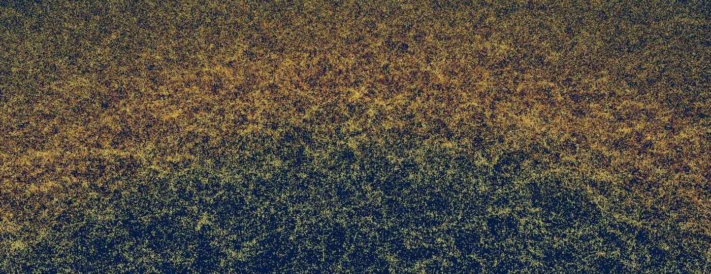

# 赛题简报 · 巡天智能体

> GOSIM 黑客松 · 巡天智能体 · 参赛说明
>
> 来源页面：<https://create.gosim.org/survey26/brief>
>
> 这份参赛说明介绍巡天运行为什么需要观测智能体、人类主值观测员的职责、挑战赛的三层规划范围、参赛者要提交什么、如何计分、所需的天文概念，以及完整赛程。
>
> 本页介绍巡天挑战的背景与思路；当前接口、提交格式及计分规则以比赛平台的规则和开发文档为准。
>
> [比赛规则 ↗](https://bh3gei.github.io/agent-observer/rules) · [开发文档 ↗](https://bh3gei.github.io/agent-observer/docs) · [返回首页 ↗](survey26.md)

---

## 目录

- [01 · 为什么：观测计划塑造了科学样本](#01--为什么观测计划塑造了科学样本)
- [02 · 观测员：人类主值观测员的职责](#02--观测员人类主值观测员的职责)
- [03 · 挑战赛制：巡天任务卡与挑战闭环](#03--挑战赛制巡天任务卡与挑战闭环)
- [04 · 规划尺度：统筹整个巡天、未来一周与下一个 900 秒](#04--规划尺度统筹整个巡天未来一周与下一个-900-秒)
- [05 · 参赛任务：构建可复现运行的观测智能体项目](#05--参赛任务构建可复现运行的观测智能体项目)
- [06 · 计分：科学、可复现、可检视的评测](#06--计分科学可复现可检视的评测)
- [07 · 名词：一点点天文学就够用了](#07--名词一点点天文学就够用了)
- [08 · 时间线：从培训到颁奖的三阶段](#08--时间线从培训到颁奖的三阶段)

---

## 01 / 为什么

### 观测计划塑造了科学样本

巡天望远镜以系统化的方式测绘大片天区。它不会把整夜时间耗在单个天体上，而是在许多个夜晚里观测成千上万个天区，从而积累起统计意义强大的星系、类星体、恒星等源的样本。

宇宙学正依赖这类大规模、均匀、定标良好的样本。广域巡天揭示宇宙的大尺度结构，约束膨胀历史，支撑暗能量测量，并把星系演化与宇宙时间联系起来。光谱巡天再加上第三个维度——红移。有了天球位置加红移，巡天就能构建宇宙结构的三维地图。**DESI** 是这一目标的一个具体公开范例：它为大样本的星系与类星体测量光谱，以绘制膨胀中的宇宙并研究暗能量。

但巡天运行极其困难：

- 天气通过视宁度、透过率与天光亮度改变一次 900 秒曝光的价值；
- 目标可见性随时间变化，取决于大气质量与天球位置；
- 不同观测项目偏好不同天况：**DARK**（暗夜）、**BRIGHT**（亮夜）与 **BACKUP**（备用）；
- 巡天天区必须被广泛且均匀地覆盖完成，才能支撑可靠的科学分析；
- 高优先级天区、接近完成的天区、覆盖不足的区域，都在争夺同一段时间；
- 一次糟糕的战术选择，就会花掉真实的观测时间，并改变后续的整个计划。

> 现代 AI 系统开辟了一条路径：助手可以读取状态、调用计算工具、在物理约束下推理、提出计划、监控质量，并解释每一次选择。
>
> 长期目标，是让一个观测智能体能够真正参与真实的巡天运行。这场黑客松，把上述长期愿景收敛成一个聚焦的基准测试。



> 天球位置加上红移，就成了一张地图——这正是巡天最终要交付的东西。
>
> *David Kirkby / DESI collaboration · CC BY 4.0*

> **分工**：参赛者设计观测员的逻辑系统；主办方提供任务定义、天区表、观测约束、天气场景、模拟器与评测协议。

---

## 02 / 观测员

### 人类主值观测员的职责

一个资深的主值观测员，在每个 **900 秒** 的时隙里都要完成一整套决策：

> 理解科学目标并决定今夜战术重点 → 读取视宁度、透过率、天光亮度与短期预报 → 判断今夜更适合 DARK、BRIGHT 还是 BACKUP 观测 → 保留当前可见、合规且有价值的天区 → 在科学产出、优先级、大气质量、天区均衡与时间浪费之间权衡排序 → 当补完的价值高于超曝代价时把天区做完 → 围绕天气系统、森林火灾烟羽、计划中的火箭发射与效率变化进行重规划 → 用快速验证信号校准后续决策 → 并解释为何在这个时段选择了这个动作。

这些职责，就是观测智能体要接手的工作。我们并不指望一个智能体一次性做得比人类更好，而是希望它能在固定接口、固定数据与固定计分下被客观评测，从而成为真实巡天运行的可行组件。

#### 九项职责清单

| # | 职责 | 关键问题 |
|---|---|---|
| 01 | **夜间策略** | 理解科学目标，决定今夜的战术重点。 |
| 02 | **天气研判** | 读取视宁度、透过率、天光亮度与短期预报。 |
| 03 | **项目选择** | 判断今夜更适合 DARK、BRIGHT 还是 BACKUP 观测。 |
| 04 | **候选筛选** | 保留当前可见、合规且有价值的天区。 |
| 05 | **天区排序** | 在科学产出、优先级、大气质量、天区均衡与时间浪费之间权衡。 |
| 06 | **完成度管理** | 当补完的价值高于超曝代价时，把天区做完。 |
| 07 | **重规划** | 应对预报中的中断、新增观测请求与变化的观测效率。 |
| 08 | **质量监控** | 用快速验证信号来校准后续决策。 |
| 09 | **理由记录** | 解释观测员为何在这个时段选择了这个动作。 |

---

## 03 / 挑战赛制

### 巡天任务卡与挑战闭环

每一个挑战实例都始于一张巡天任务卡（Survey Mission Card）。任务卡描述科学目标、天区面积、时间预算、望远镜台址、可用观测项目、目标类别、观测约束与计分规则。任务卡与公开开发数据——天区目录、示例天气场景、初始状态与可视化报告——将在黑客松开始前发布。

所有参赛者面对同一套评测场景：总体巡天计划、逐夜视宁度与天气回放、临时观测请求、可预见的中期中断、模拟器和计分规则全部固定。智能体读取当前状态，每 900 秒返回下一步观测动作。

#### 挑战赛闭环

| 阶段 | 内容 |
|---|---|
| **固定输入** | 科学目标 · 巡天天区 · 天气回放 |
| **智能体状态** | 天气与预报 · 巡天进度 · 可用天区 |
| **推理** | 排序 · 解释 · 决策 |
| **动作** | 观测 · 或等待 |
| **指标** | 科学产出 · 均匀性与浪费 · 违规 |

---

## 04 / 规划尺度

### 统筹整个巡天、未来一周与下一个 900 秒

挑战赛制覆盖**三层规划范围**，由大到小：

**长期** —— 主办方通过任务卡提供总体巡天计划，智能体在运行中管理该计划；最终评分包含巡天完整度与完成质量。

**中期** —— 智能体依据完成进度和预报制定灵活的月、周、日计划，吸收天气系统、森林火灾烟羽、计划中的发射和新增观测请求。随着任务卡演进，这一层可由主办方决定是否启用。

**短期** —— 每个 900 秒时隙，智能体根据中期计划以及实时视宁度、透过率作出战术选择。**这是计分基准的重点**。

---

## 05 / 参赛任务

### 构建可复现运行的观测智能体项目

项目须实现比赛平台当前版本的智能体接口。正式比赛的程序包使用 **Python 3.12** 运行环境；请从平台下载入门工具包。本站示例仅用于说明观测决策思路，正式接口以平台开发文档为准。

练习阶段可以上传观测结果文件或智能体程序包；正式线上比赛只接受智能体程序包，由平台在隐藏场景中运行。

阅读平台规则与开发文档，下载入门工具包，在公开场景中开发测试，再通过平台提交。平台提供评分报告、运行日志与决策回放。

#### 智能体返回动作示例

```json
return {
    "action": "observe",
    "tile_id": 100123,
    "plan": "DARK",
    "reason": "good weather and highest useful gain"
}
```

---

## 06 / 计分

### 科学、可复现、可检视的评测

当前平台采用 **challenge-score-v3**：

```
score = base_science + program_bonus + request_reward - penalty_total
```

- 总分由**基础科学产出**、**项目加成**和**请求奖励**构成，再扣除**惩罚项**。
- 正式阶段有多个场景时取场景得分均值。
- 排行榜采用**每队最佳已评分提交**。
- 具体规则以比赛平台为准。

#### 评测遵循开放科学原则

- **固定数据与固定计分**，让每份观测结果都按同一标准评估；
- **可读的结果文件**便于检查最终产出；
- **开发天气与最终评测天气分离**，比较的是泛化能力，而不是针对已知场景调参。

#### 结果可视化

结果可视化把已完成的天区比例转换成「已观测目标图」——**三维空间采样与二维蝴蝶图**（天球位置加模拟红移，风格与 DESI 一致），让不同策略肉眼可辨。


> 评审叠加图：灰色是完整的目标星表，彩色是某个智能体真正观测到的部分。**策略的差别，一眼可见**。

#### 未来可承载的任务卡

- 真实巡天日志回放
- z > 5 类星体规划
- LBG 规划
- 临时目标插入

社区也可以为后续赛道提议新的固定数据集。

---

## 07 / 名词

### 一点点天文学就够用了

不是天文专业也能读懂状态字典并据此推理。

#### 基本概念

| 名词 | 含义 |
|---|---|
| **天区 Tile** | 望远镜一次指向的一小片天空 |
| **巡天天区 Footprint** | 整个巡天区域 |
| **目标 Targets** | 每个天区内的天体计数 |

#### 巡天要素

- **高优先级天区** — 具有额外科学权重
- **接近完成的天区** — 只差一次曝光
- **覆盖不足的区域** — 进度落后于巡天整体
- **donefrac** — 表示天区完成度，0 表示刚开始，1 表示已完成

#### 天气与大气

| 指标 | 含义 | 取向 |
|---|---|---|
| **视宁度 Seeing** | 描述大气扰动造成的模糊 | 数值越低越好 |
| **透过率 Transparency** | 越高表示大气越通透 | 数值越高越好 |
| **天光亮度 Sky brightness** | 背景光 | 对暗弱目标越暗越好 |
| **大气质量 Airmass** | 衡量光线穿过多少大气，随天球位置变化 | 数值越低越好 |

#### 观测项目分类

**DARK / BRIGHT / BACKUP** 分别匹配**暗夜**、**亮夜**和**较差天况**。

#### 状态字典

```
{
  weather:      // 当前视宁度、透过率、天光亮度、观测项目、可观测性与速度
  forecast:     // 当前时隙加上未来四个时隙
  progress:     // 已完成天区数、平均完成度、天区均衡度、浪费时间与违规次数
  available_tiles:  // 当下的合法选项，包含期望增益、期望浪费、目标计数、优先级与大气质量
}
```

```json
return {
    "action": "observe",
    "tile_id": 100123,
    "plan": "DARK",
    "reason": "good weather and highest useful gain"
}
```

---

## 08 / 时间线

### 从培训到颁奖的三阶段

赛事分为三个阶段：**10 月 1–4 日**线上培训、**10 月 5–7 日**线上比赛，以及 **10 月 17 日** GOSIM 深圳大会颁奖。

培训将介绍 CosmosBench、统一模拟器、任务卡和观测员接口。线上比赛期间，已报名队伍提交智能体程序包；运行、测评与排名由 Agent Observer 比赛平台提供。

#### 三阶段详解

**01 · 线上培训（10 月 1–4 日，线上）**

- **巡天任务**：熟悉 CosmosBench、统一模拟器、任务卡和观测员接口，并使用公开开发场景完成准备。
- **参与范围**：面向全球开放，个人与团队均可参加。

**02 · 线上比赛（10 月 5–7 日，线上）**

- **巡天任务**：提交智能体程序包，由 Agent Observer 比赛平台运行、评测并公布排名。
- **参与范围**：所有完成报名的参赛队伍。

**03 · 颁奖日（10 月 17 日，GOSIM 深圳）**

- **巡天任务**：公布最终成绩并举行颁奖典礼。
- **参与范围**：获奖队伍及受邀参赛者。

---

## 准备好构建下一代观测员了吗？

[立即报名 ↗](https://bh3gei.github.io/agent-observer/register) · [比赛平台 ↗](https://bh3gei.github.io/agent-observer) · [入门工具包 ↗](https://bh3gei.github.io/agent-observer/resources)

---

**OPEN / OBSERVER** · 2026 GOSIM · 巡天智能体 · [GOSIM ↗](https://gosim.org)

---

## 附：本页新增素材

- `survey26_brief.md` — 本文档
- `../assets/agent-observer/cosmos-dome-D1P_eEvz.jpg` — 巡天穹顶视觉
- `../assets/agent-observer/survey-redshift-map-Bal3YYAj.jpg` — 天球坐标 + 红移巡天地图（DESI）
- `../assets/agent-observer/survey-review-overlay-BD2bBt4R.jpg` — 评审叠加图（固定星表 vs 智能体观测）