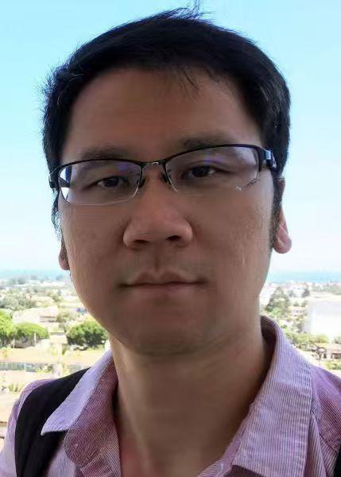
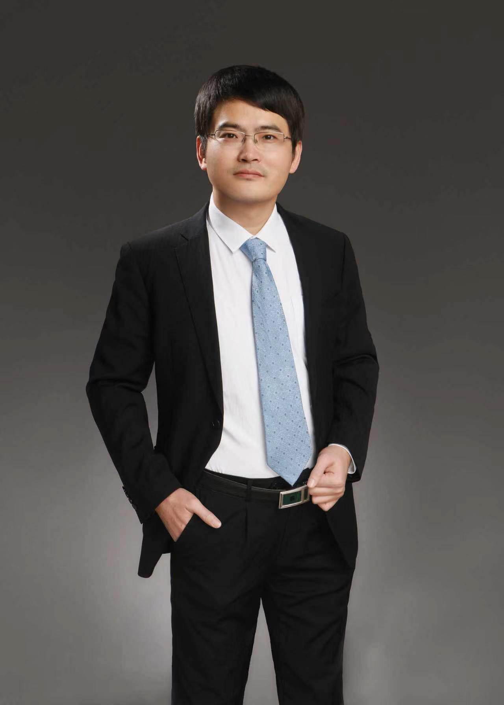
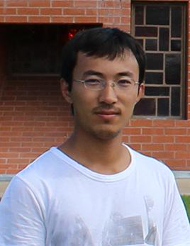
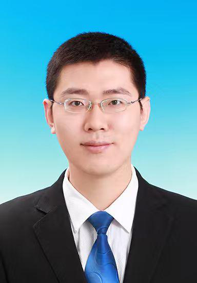
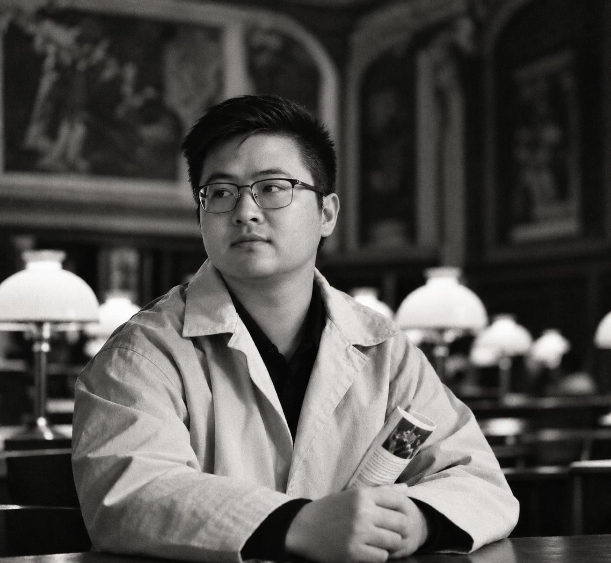
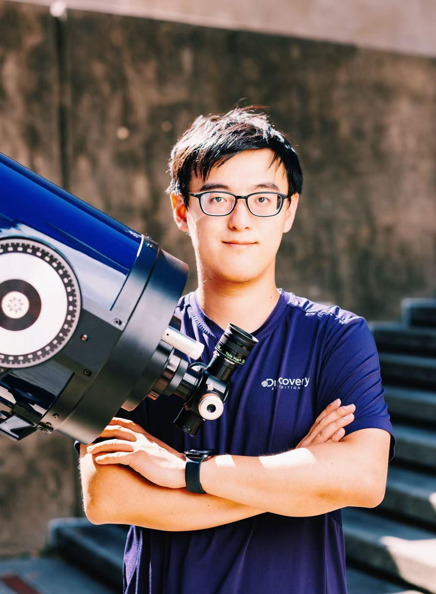

# GOSIM HANGZHOU 2026 黑客松 + 巡天望远镜科学委员会

## 翟忠旭

上海交通大学天文系 · 副教授

个人页面：<http://astro.sjtu.edu.cn/zh/staff/people/199->

## 王伟

上海交通大学物理系 · 教授

## 刘德子

云南大学 中国西南天文研究所 · 副研究员

## 刘项琨

云南大学 中国西南天文研究所 · 教授

## 陕欢源

中国科学院上海天文台 · 研究员

## 谭铤

巴黎萨克雷大学 - 法国原子能署 · 博士后研究员

## 罗逸飞

劳伦斯伯克利国家实验室 · 博士后研究员

